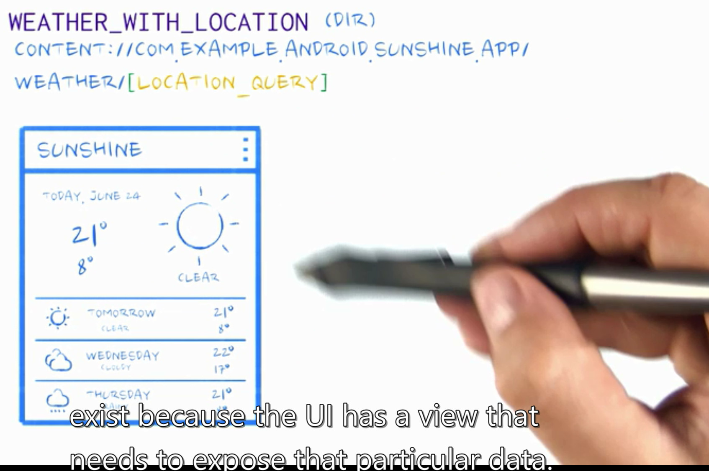

- 完全展示content provider添加的过程
- 动态展示单元测试的过程

#overviw 图

还是老图，(create / insert /query)


下面 我们开始 content provider的学习

```
复习四大 组件

content provider
service
broadcast provider
actvity 
```
#本章 overview


#4.07 init code for content provider

- 测试打桩函数就占了大半
- 然后传统的函数里面修改了 weatherContrace
	- 增加了 weatherProvider
	- 修改了 fetchweatherTask函数，代码的来源是
	从 forececastFragment代码拆解出来的。
- 除了修改weatherContrace,其他文件都是 新增加的

    
##关键词 uri
weatherContract里面增加的最多就是生成uri的函数
``` java


    /* Inner class that defines the table contents of the location table */
    public static final class LocationEntry implements BaseColumns {
	...
        public static Uri buildLocationUri(long id) {
            return ContentUris.withAppendedId(CONTENT_URI, id);
        }
    }

	
	
	===
	
```

``` java
	/* Inner class that defines the table contents of the weather table */
    public static final class WeatherEntry implements BaseColumns {

		...
        public static Uri buildWeatherLocation(String locationSetting) {
            return null;
        }

        public static Uri buildWeatherLocationWithStartDate(
                String locationSetting, long startDate) {
            long normalizedDate = normalizeDate(startDate);
            return CONTENT_URI.buildUpon().appendPath(locationSetting)
                    .appendQueryParameter(COLUMN_DATE, Long.toString(normalizedDate)).build();
        }

        public static Uri buildWeatherLocationWithDate(String locationSetting, long date) {
            return CONTENT_URI.buildUpon().appendPath(locationSetting)
                    .appendPath(Long.toString(normalizeDate(date))).build();
        }

        public static String getLocationSettingFromUri(Uri uri) {
            return uri.getPathSegments().get(1);
        }

        public static long getDateFromUri(Uri uri) {
            return Long.parseLong(uri.getPathSegments().get(2));
        }

        public static long getStartDateFromUri(Uri uri) {
            String dateString = uri.getQueryParameter(COLUMN_DATE);
            if (null != dateString && dateString.length() > 0)
                return Long.parseLong(dateString);
            else
                return 0;
        }
    }
}
```

#4.08 uri location with weather
仅2处更新

## 1/2 weatherContract
```
        /*
            Student: This is the buildWeatherLocation function you filled in.
         */
        public static Uri buildWeatherLocation(String locationSetting) {
            return CONTENT_URI.buildUpon().appendPath(locationSetting).build();//上一版本这里返回空值
        }
```
    
    
 ##2/2 test
 
 仅仅打开 这里的注释
 ``` java
/*
    Students: This is NOT a complete test for the WeatherContract --- just for the functions
    that we expect you to write.
 */
public class TestWeatherContract extends AndroidTestCase {

    // intentionally includes a slash to make sure Uri is getting quoted correctly
    private static final String TEST_WEATHER_LOCATION = "/North Pole";
    private static final long TEST_WEATHER_DATE = 1419033600L;  // December 20th, 2014

    /*
        Students: Uncomment this out to test your weather location function.
     */
    public void testBuildWeatherLocation() {
        Uri locationUri = WeatherContract.WeatherEntry.buildWeatherLocation(TEST_WEATHER_LOCATION);
        assertNotNull("Error: Null Uri returned.  You must fill-in buildWeatherLocation in " +
                        "WeatherContract.",
                locationUri);
        assertEquals("Error: Weather location not properly appended to the end of the Uri",
                TEST_WEATHER_LOCATION, locationUri.getLastPathSegment());
        assertEquals("Error: Weather location Uri doesn't match our expected result",
                locationUri.toString(),
                "content://com.example.android.sunshine.app/weather/%2FNorth%20Pole");
    }
}
 ```


#4.09 write uri matcher
## 1/2 weatherProvider
这是框架里面的代码，更新一处
``` java
    /*
        Students: Here is where you need to create the UriMatcher. This UriMatcher will
        match each URI to the WEATHER, WEATHER_WITH_LOCATION, WEATHER_WITH_LOCATION_AND_DATE,
        and LOCATION integer constants defined above.  You can test this by uncommenting the
        testUriMatcher test within TestUriMatcher.
     */
    static UriMatcher buildUriMatcher() {
        // I know what you're thinking.  Why create a UriMatcher when you can use regular
        // expressions instead?  Because you're not crazy, that's why.

        // All paths added to the UriMatcher have a corresponding code to return when a match is
        // found.  The code passed into the constructor represents the code to return for the root
        // URI.  It's common to use NO_MATCH as the code for this case.
        final UriMatcher matcher = new UriMatcher(UriMatcher.NO_MATCH);
        final String authority = WeatherContract.CONTENT_AUTHORITY;

        // For each type of URI you want to add, create a corresponding code.
        matcher.addURI(authority, WeatherContract.PATH_WEATHER, WEATHER);
        matcher.addURI(authority, WeatherContract.PATH_WEATHER + "/*", WEATHER_WITH_LOCATION);
        matcher.addURI(authority, WeatherContract.PATH_WEATHER + "/*/#", WEATHER_WITH_LOCATION_AND_DATE);

        matcher.addURI(authority, WeatherContract.PATH_LOCATION, LOCATION);
        return matcher;
    }

```

## 2/2 test
依然是已经写好的测试代码框架，这里仅仅打开注释

``` java
public class TestUriMatcher extends AndroidTestCase {
...
    /*
        Students: This function tests that your UriMatcher returns the correct integer value
        for each of the Uri types that our ContentProvider can handle.  Uncomment this when you are
        ready to test your UriMatcher.
     */
    public void testUriMatcher() {
        UriMatcher testMatcher = WeatherProvider.buildUriMatcher();

        assertEquals("Error: The WEATHER URI was matched incorrectly.",
                testMatcher.match(TEST_WEATHER_DIR), WeatherProvider.WEATHER);
        assertEquals("Error: The WEATHER WITH LOCATION URI was matched incorrectly.",
                testMatcher.match(TEST_WEATHER_WITH_LOCATION_DIR), WeatherProvider.WEATHER_WITH_LOCATION);
        assertEquals("Error: The WEATHER WITH LOCATION AND DATE URI was matched incorrectly.",
                testMatcher.match(TEST_WEATHER_WITH_LOCATION_AND_DATE_DIR), WeatherProvider.WEATHER_WITH_LOCATION_AND_DATE);
        assertEquals("Error: The LOCATION URI was matched incorrectly.",
                testMatcher.match(TEST_LOCATION_DIR), WeatherProvider.LOCATION);
    }

```
···


#4.10 register content provider
##1/2
这里仅仅使能（打开注释） testProviderRegistry
``` java

public class TestProvider extends AndroidTestCase {

	...
    /*
        This test checks to make sure that the content provider is registered correctly.
        Students: Uncomment this test to make sure you've correctly registered the WeatherProvider.
     */
    public void testProviderRegistry() {
        PackageManager pm = mContext.getPackageManager();

        // We define the component name based on the package name from the context and the
        // WeatherProvider class.
        ComponentName componentName = new ComponentName(mContext.getPackageName(),
                WeatherProvider.class.getName());
        try {
            // Fetch the provider info using the component name from the PackageManager
            // This throws an exception if the provider isn't registered.
            ProviderInfo providerInfo = pm.getProviderInfo(componentName, 0);

            // Make sure that the registered authority matches the authority from the Contract.
            assertEquals("Error: WeatherProvider registered with authority: " + providerInfo.authority +
                    " instead of authority: " + WeatherContract.CONTENT_AUTHORITY,
                    providerInfo.authority, WeatherContract.CONTENT_AUTHORITY);
        } catch (PackageManager.NameNotFoundException e) {
            // I guess the provider isn't registered correctly.
            assertTrue("Error: WeatherProvider not registered at " + mContext.getPackageName(),
                    false);
        }
    }
	}
```
##androidManifest update
```
        <provider
            android:authorities="com.example.android.sunshine.app"
            android:name=".data.WeatherProvider" />
```


#小憩
增加provider布凑
	- 估计要从 1代版本代码 和 2代代码 进行比较
##聪明的编译器
智能提示
android 在debug模式下，有很有趣的话题在里面，比如变量值的提示
还有搜索字符时，主动过滤注释里面字符


#test ok 单元测试的方法 && testPractise

并且 我没有选右键触发，而是直接 run ( shift f10)
（4a-28 ）里面单元测试的方法，完全可以复现


- 展现运行的配置
- 展示出错情形如何定位错误
- 展示正常情况
```
使用的是 sunshine version2 的4.02的代码，code: testPractise
```
```
todo 实践后思考
空白的android test工程是怎样的？
4.02章节里面，命名只有有效的3个testcase,怎么显示有6个testcase ?

```

## testDb之testCreateDb
4.04 (git version) delete the testPractise,
```
实际运行记录：
我在所有的 assertTrue,assertFalse,assertEqual
位置都下了断点，但是只有testDb中的testCreateDb 被触发，
数字上，run窗口显示的“6 of 6”ok,
但6个中的4个被触发，
我怀疑这个6是不是显示过时
```
## testdb之testLocationTable
测试完全通过.

- 该函数完整的调用了db的操作函数
	- insert
	- query
	
并且有趣的是调用了TestUtilities.validateCurrentRecord。
(这里面还有2个assert,这里面的断言终于被触发了)


这是我观察中
testUtilities类中函数的第一次调用，
上一轮，我在这个类的static函数里面设置断点，
都没有被调用。

还有这个类testUtilities提供了数据库插入的样本数据

```
todo
实践后思考：
既然单元测试都是利用AndroidTestCase
那么为什么每次都是testDb被调用，
而其他AndroidTestCase的继承类testUtilities 没有被直接调用.
```


##testWeatherTable 和重构 testLocationTable
4.06 lesson,
而且有趣的是前者内部调用调用了
locationTable的内容

竟然所有的测试通过了


```
todo 内容深入分析
        // Fifth Step: Validate the location Query
        TestUtilities.validateCurrentRecord("testInsertReadDb weatherEntry failed to validate",
                weatherCursor, weatherValues);
```

##小憩
github 前6个小节，就是认识单元测试

单元测试的魔力很大啊，这里

#后续
from 4.06 -4.10 (github)
测试函数有：
- test weatherContract
- test uri matcher
- test Provider
	- test providerRegistery

构造一个content provider，每个模块都不能马虎


#晚安 小憩
至少方向是光明的


# 下一天 复习
解释 前面 为什么 不是 全部的uri都被命中



再看 weather provider 和 testProvider的演示
作者是逐一功能的enable,逐一测试。逐渐深入

几乎每种testProvider的函数(query/getType/insert/updat)
都含有uri matcher的筛选

新近发现 可以 查看 每一个测试的内容：


video 4b-24 是个阶段总结

`bulkinsert 其实利用了事务，只有endtrancsation 才执行操作`


##小节
小节：整章节 就是 uri 使用
- define uri
- update uri(feflect to number)
- uri matcher (I think ,here addmatch)
- implement (I think, sUriMatcher.match(uri);)


`说到，开源很多 封装了 content provider ? toco`
`如何理解 notification oserver ..here`

#整合
至此，我们的content provider 还没有和 database 联合起来。
操作不是 test*.java,也不主要是 weatherprovider里面

我们将精力集中到 FetchweatherTask
- addlocation
- getWeatherDataFromJson insert + query part
(网络收报后的处理例程)

看到凡是使用了getContentResolver的地方，都是利用了contentprovider的地方，


#最后
为了ui theread 更加流畅，引出Loader
`至此，我们的video 来到4b的借书，代码`
代码范围是：


##附code


