#udacity android lesson 2

这里我们从2-17开始，至此我们的demo可以显示List,但是网络通信的代码放在主线程里，所以我们需要改进他。

##async is not optional
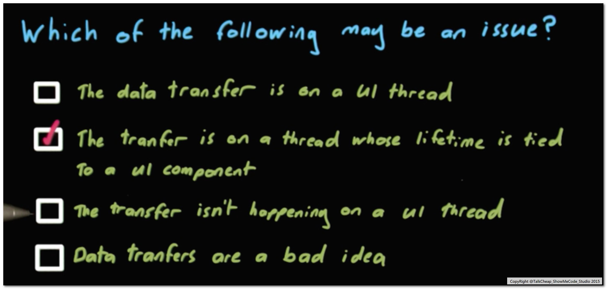

当activity组件被某些东西终止，比如旋转屏幕。data传输会受影响

##todo activity声明周期

##better way
 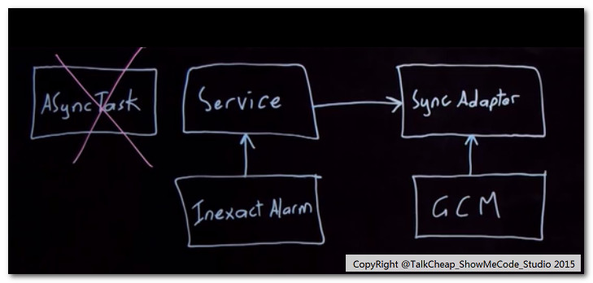
 
- not use refresh button
- not effect by the activity lifecycle

##menu +buttons
原理上是
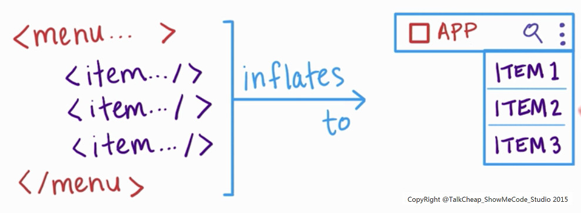
代码上体现，简言之，就是更新Menu.xml下面的item内容

此后，考虑refresh button,修改位置是layout相关的xml.
运行demo后，button并没有显示，创建button的代码当前还没有更新


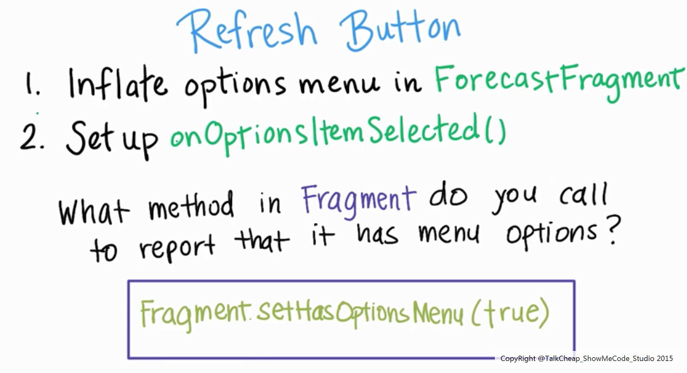
如果button没有显示，请check图中给出api

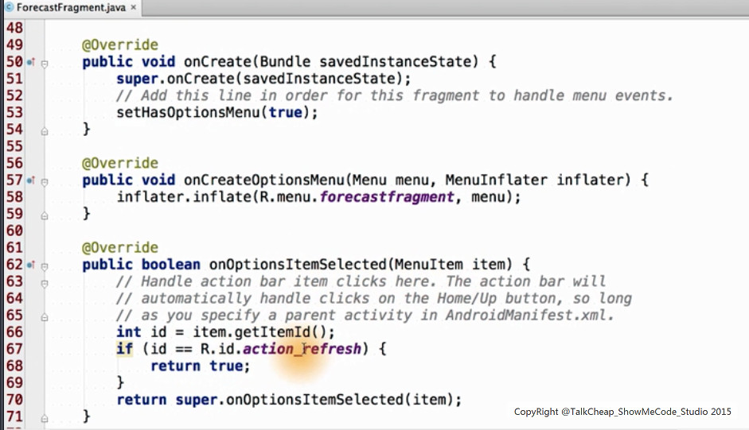
上面给出初始化refresh button和button响应的相关代码

##不完美，继续改进
直接运行以上代码，crash

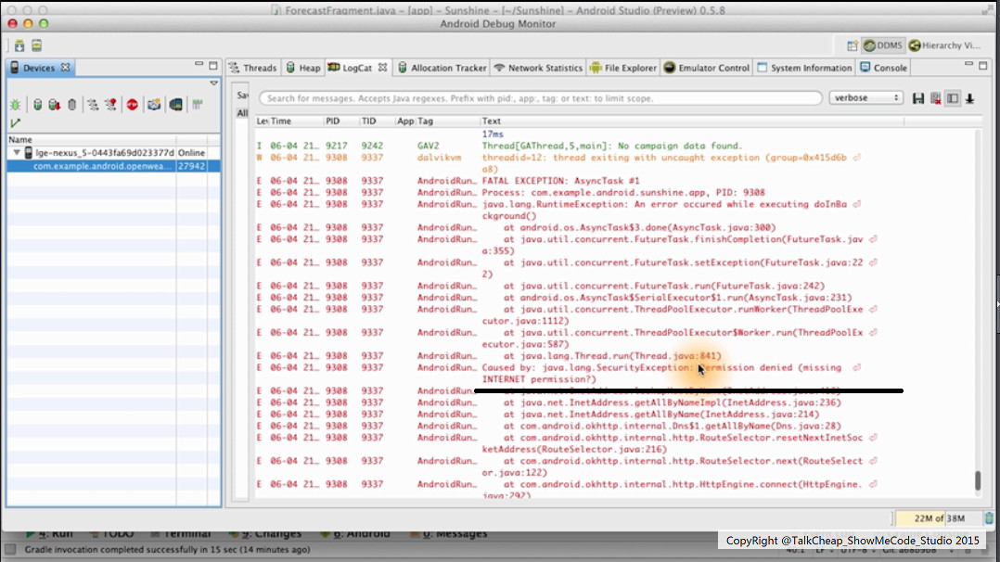
原因是权限问题（没有申请 internet权限）,catherine非常有趣的制造的错误，同时也交给我们如何使用logcat来诊断app的错误，真是授人以渔！


##权限机制 沙盒
解决方案：当前，只请求需要的权限

不可避免请求高的权限，可以思考有没有替代方案
- 如用intent启动应用（如相机）
- 共享数据的方法：例如使用intent和content provider 架构应用程序沙盒

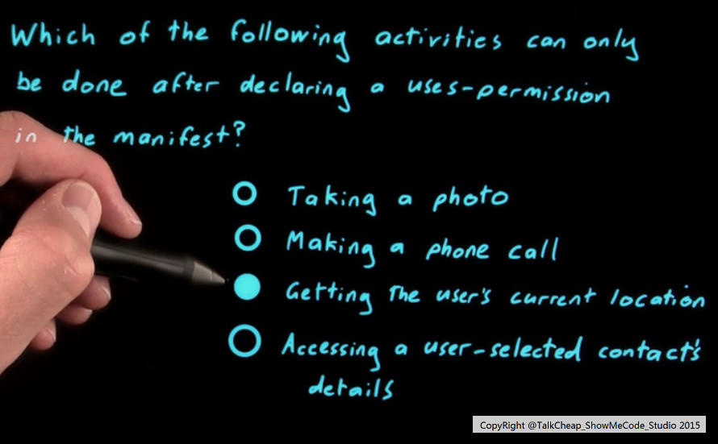
 
###internet 权限 管制
用户可以动态拒绝的权限的赋予。

简言之，我要用户来决定是否赋予某种权限，
那么我需要在androidManifest.xml给出
```
android.permission.INTERNET
```
在拿到INTERNET权限后，
catherine 接着在代码层次讲解了 JSON数据的调用，并在命令行下利用loagcat看到了没有解析的JSON数据，其实这又是一种debug方法的演示

至此，我们的demo可以成功接收到数据啦。

###自定义参数（邮编）
- 以前的请求串是字符串拼接
- 现在的请求串是uribuilder构建
- 检测方法，logcat

####带参数的fetchweathertask 
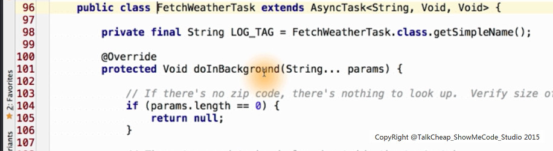

往下看看urlbuilder的真面目，还有调试的接口吧
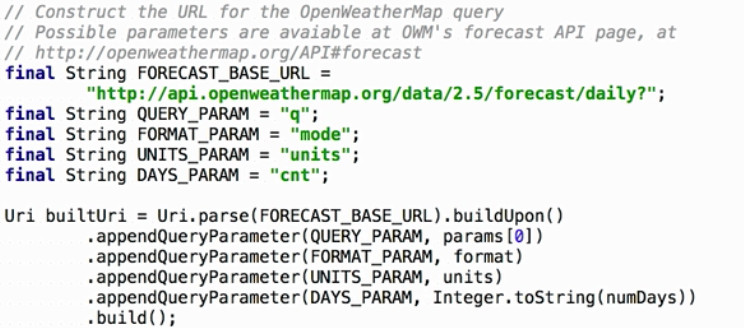

###json解析
####json属性
- json fromater      阅读器
简言之整理需求
- max tempature ?
有趣的发现，udacity网站竟然还有在线的java json练习

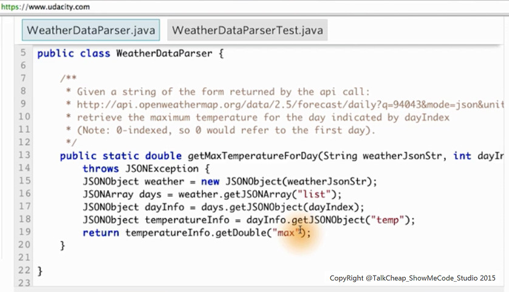
一种典型树状数据结构的解析

####！！ jason parsing 
在了解基础后，我们将有3个函数处理json

helper method
-  formate date
-  fromae the max/min temperature
-  transfer the JSON string to array we need (这里就用到上个小节的解析方法)

几乎所有的方法都在  FetchWeatherTask的doInBackground中调用

当功能正确，我们将会得到以下输出
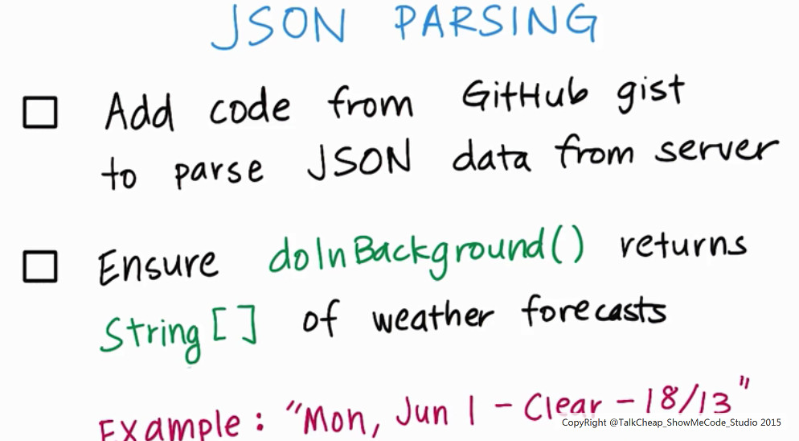

###update the adpater + UI
this is the 2-42 lesson and 2-43 's content.
hotkey is "ctrl+o" ,it can give method of parent class
```
我眼中的arrayAdapter就是前台进程（asyncTask)和后台通讯的桥梁
```

####分析arrayAdapter
数据共享的策略
-   将以前的private arrayAdapter 变为全局变量

如果初始化arrayAdpater有误，将会有unsupported operation exception

上述描述 待运行实际代码后更新
 
####更新onPostExecute
 接着 我们将更新 onPostExecute
 ,这里我们将会看到Listview的更新
 
```
更新listview的两种策略
- 低版本(<honeyComb)，使用迭代器
- 高版本（>=honeyComb)，使用addall
```

####架构图 回忆
数据更新导致view更新的流程
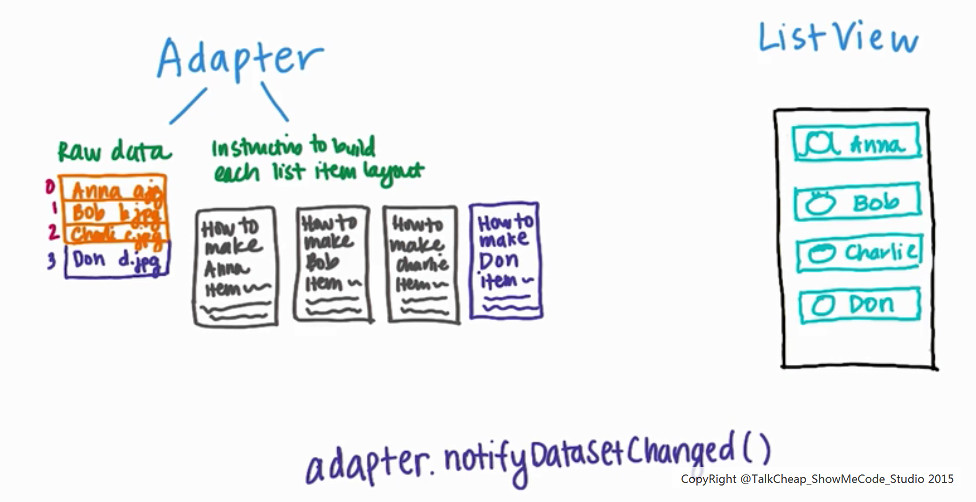

话说 adapter.nofitfyDatasetChanged()是被自动调用，我们看看真相。

#####深入浅出 源代码

你需要查看framework下面的arrayadpater.java

- add方法，调用了nofitfyDatasetChanged
- addAll方法，也调用了nofitfyDatasetChanged
- 从效率来说，addAll针对一组数据只调用一次nofitfyDatasetChanged，因此效率更高

```
这其实就是传说中的观察者设计模式
```

```
tips:android frame code是个宝箱！
某种程度上说，对android framework的了解程度决定android程序员的水平
```

##take a screenshot
可以利用android debug monitor的自带功能，帮助开发者来标示进度

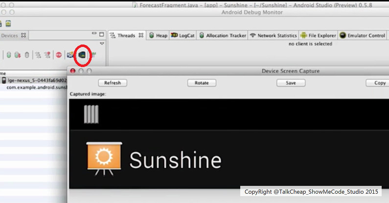

至此，refresh功能完工，
还是给catherine爆张照片出来吧，好欢乐的程序媛

catherine 准备大睡一场啊，lesson3见

##其他
视频的 47,48,49,50,51十一前的重复。
所以你可以小憩一下啦
### todo
第二章 所有代码运行后，我会更新部分章节


 
 


