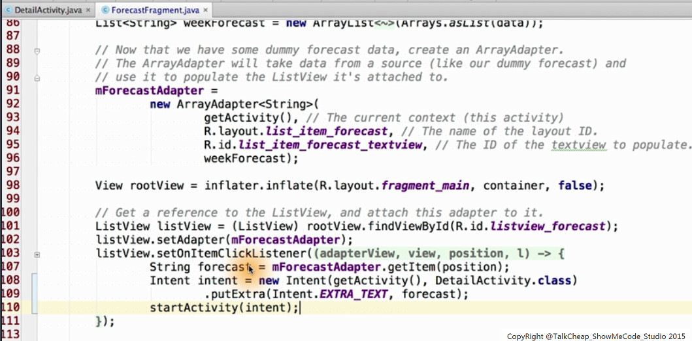
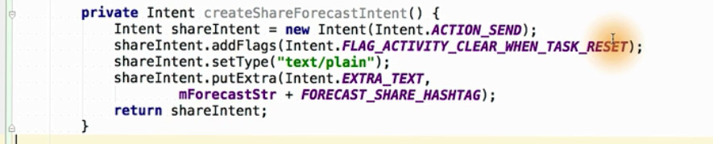

# udacity android lesson 3
more activity learn
Intent framework
内容作为学习笔记，估计后期将会分成三部分。

#理论
start baby steps
##click item的事件响应
关键是ItemClickListener


##调试利器 toast 
有点类似mfc中的afxmessage哈，

### ItemClickListener + toast 代码实践


## detail activity
lesson 3-8引出detail activity
###实践

当新建activity（DetailActvity)成功后，会增加以下文件

- new activity java file (eg:DetailActvity.java)
- relative fragment（eg: fragment_deatil.xml)
- relatvie layout(eg:activity_deatil.xml)
- 其他如anroidManifest被改变

### Intents framework

一个activity移动到另外一个activity时，使用startactivity,参数是intent


```
一种直觉，感觉intent封装了类似c的线程间通讯（2个activity)+进程间通讯(2个app)
```
当进行到3-11课时，Rado讲解内容如下：

intent内容应该含有：
- Not class name
- but action done by another activity
- and the data the action should be performed


### lauch DeatilActivity 代码实践
取代以前的toast
```
扩展：隐藏式/显式 intent区别
```



去除以前toast的代码，换为intent
intent的初始化就是键值对的初始化，这里是显式intent

```
和传统的mfc事件编程相比，这里站在更高的抽象层次。
mfc是一个list item对应一种事件，我用过的mfc,每个事件和一个固定的Itemid绑定。
```

到此，只解决了intent填充内容，下一步我们要在detailActivity中，解析intent传递过来的内容


### Display Content DetailActivity 代码实践

```
貌似 ctrl+o 提示 在这里大显身手，待实践证明
todo:在群上 有对工具的分享，alt+enter 自动类型转换的提示
```

- 取得intent
- 在detailView中显示

```
3_16课 很耍宝，(￣▽￣)"
当前setting 会不会工作啊，待实践证明
```

###setting UX
wire frame 图


如果需要科学的做需求设计，可以参考如下：

上述流程图会告诉你什么可以做，什么不可以做

####shared preference
第一次听，直觉是可以重用的系统setting？

android developer options 有很多setting 设计的参考


上面有代码，直接取到系统的preference,
每一种prefence对应一个值，数据结构上就用键值对来存储。


要导入系统的相关preference,上述图告诉方法。

代码上的变化：
- 增加settingActivity
- androidManifest
  告知activity,还有parent
- string.xml

#### lauch setting Activity 代码实践

```
待补充
```


这样的修改在mainActivity 和DetailActivity都有。

####休息
3_23 停留

####开工
第三节课 本质 就是
将 activity listener
还有shared setting

####添加location perference 相关的xml

##### hard code style

##### style with string.xml


#### modify settingActivity
```
lesson 3-24 声明原理
lesson 3-25 只说到用户自己参考api:
use user's location prefence when fetching weather data from server

```
- load preferences xml layout in settingsActivity
- bind preference summary to value for loaction setting
```
中文解读：
1）读取resource文件中的 perperence layout
2）为loation 设置 绑定事件响应
bindPreferenceSummaryToValue
```


#### use shared preferences 代码实践
原理参考sdk网站，
主要代码参考如下：

简言之，就是从preference这个键值对里面取到我们需要的值，然后作为参数传给天气任务。

#### ！！ 真正的 refresh
我们要解决的问题是去除以前的dummy data,使用真数据。

数据的刷新是updateWeather函数做得，
这个函数在 forcastFragment.java中。

我们来看哪些地方调用了它
```
onOptionsItemSelected
 	updateWeather
```

```
onStart
	updateweather	
```

ok,主要是上面两处，还有还要把forcastFragment中的 onCreateView的假数据都删除


检测方法是， 进入app,输入新的location,看看有没有数据变化。


## temprature unit setting
```
理论 3-28
实践 3-29
todo:争取把其他使用代码的图给换成 真实的代码 
```

关键词，复习
要用一种新的 preference subclass(sharedpreference 的一种): listpreference, 


途中，可以看到list preference的layout设置，
关于entryValue和entries的作用，我现在不是特别清楚，貌似前者常量，而非用户不可见。

```
todo 关于entryValue和entries的作用
```
下面将设计显示 气温单位 选项的代码
主要是添加
```
settingActivity
	onCreate
    	bindPreferenceSummaryToValue(getString(R.string.pref_units_key))
```
上述完成绑定。

决定 温度显示格式的代码是
```
forecastFragment
	formatHighLows（...)
    {
    	If(转换为imperial == ture)
        	....
       	else
         	doNothing
        
        ...//最高温和最低温放一个字符串返回
      }
```
 
## ！！调试技巧 debug breakpoint
```
3-30 详细介绍这里的内容
```
我不会告诉你，我当初找debug功能是找了半天的。
要调试，不仅要学会打Log，还要step by step 追踪。
以这里的preference 功能调试为例，我们将在setingActvitiy中以下两处下断点。

- line 59: preference.setSummary(listPreference.get...)
- line 63:
preference.setSummay(stringValue);
 
如果设置成功的话，那么每次在preference里面设置的值都可以在上述某断点查看到。
并且continue过后的话，将会在界面上更新。

```
关于调试的几点扩展
1.debug or relase exist
2.条件断点
3.支持多线程吗
4.adb 模式如何调试
5.可以加入framework 代码 进行调试吗
6.可以支持jni代码的调试？ c? 字节码？
7.一本iso书的代码引入
```

## launch implict intent
```
3-31 直觉：站在巨人的肩膀上，引用其他app功能
3-32 深入分析
3-33 solution
```


添加新的 setting item

请注意，同时要更新  strings.xml中的字符串 action_map


上面是使用 Intent的代码（代码还不完整），主要是
加入 openPreferredLoactionInMap
```
todo 深入openPreferredLoactionInMap
```

##rest time - 第三轮
It is time to have a rest
now 进行到 3-34
都用了两小时了

##intent resolution
每个app的actvitity都有如下的过滤器处理地图相关的intent
```
<intent-filter>
	<action = "android.intent.action.VIEW"/>
    <data android:scheme ="geo"/>
</intent-filter>
```
简言之，过滤器

##share intent介绍
这是被开发者使用得最多的Intent

- 实现形式
shareActionProvider的action_SEND操作


```
tips:使用ctrl+shift+左右 查看对应的关键帧
连续按D/F 帧的粒度更小
tips : when use potplayer,
定制播放窗口初始化大小，还有视频，详细见
x_tips_player.jpg
```
紧接着，我们来看看线框图吧，辅助设计


所有的实现都在detail activity里面展开。


以上我们的todo list

## share intent 代码实践
这是课程3-36的内容。
首先来填个字符串吧，就在strings.xml,标记action_share

然后我们新添加一个menu相关的xml,取名为detailfragment.xml,内容如下(本方法仅对android 4.0及以上版本有效)，


第三步，修改 DetailFragment的内容，
添加log_tag，和一个标记字符串，


第四步，这才是关键的，修改onCreateView，
```
每个activity都有自己的intent
```

- get intent
- filter extra_text
- set value to the orignal intent "EXTRA_TEXT"

第五步，继续
刚点的INTENT是我们自己封装的啊，

其中要注意的是：
- action_send类型的activity
- 不保存状态(分享出去的activity是不用保存的）的标志， flag_actvity_clear_when_task_reset
，如果不设置，那么在退出这个activity将会遇到烦恼


第6步，就是使能操作，
往DeatailFragment的构造函数里面添加 
```
setHasOptionsMenu(true);
```
只有这个标志位有了，才会调用onCreateOptionMenu() ，这可是最后一步的劳动成果 


最后一步，创建我们的onCreateOptionMenu,

简单说来，这就是我们的Menu响应函数

总结刚才内容，这是我第一次理解的层次（后面将会更新认识）
- (step 1+2)准备好布局
- (step3+4+5) 初始化intent
- (step 6/7)menu响应函数

###小憩
尼玛，先在大脑中各种intent奔走中，休息一会

##broad intent
- 系统发送信息如充电等，是通过sendBroadcast方法实现的
 
```
3-37 原理介绍
3-38 代码框架+ 接受的两种实现
```
这门课的干货，也比较多，主要就是将如何合适的接受广播内容。

先放上一个经典的图，


以下四个图，分别从maniest方式 和 动态方式的介绍了 接收器代码的 实现


下面我们就对刚才学到的广播接收的原理，应用到充电事件的接受上，


#里程碑时间
- How to create new activity
- the relation with activities
	- 结构层次
	- 导航（Parent child)
- how to use the INTENT

激动人心的activity 生命周期在下一节课。
- 数据保存
- 数据库 
- contentProvider 

其他，android play的介绍（高质量/稳定）


#小节：
晚上用时 1个半小时


#其他

what is frament ?

开源oj p.a.t app
middle:Dan
raydo , 
catherine


地点：上海大学宝山校区C区1楼某教室


     


