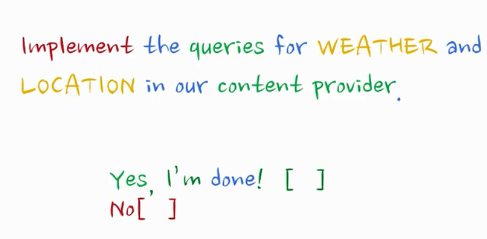
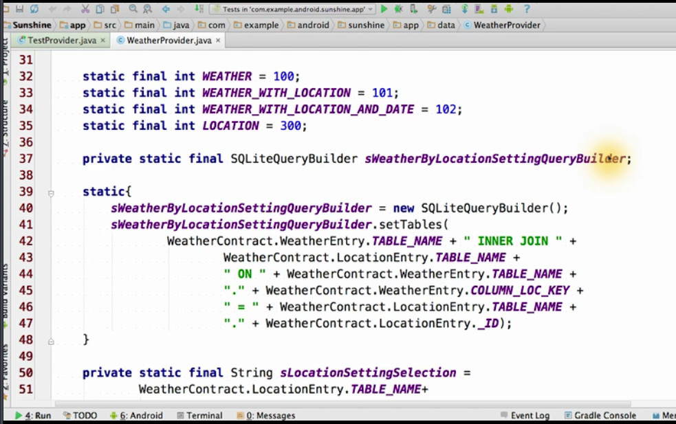

```
lesson 4b，后期将拆分为4大小节
强烈建议保留自己重命名的字幕，重新压制
29 units are waitted 

上一章节完成了 db的创建和内容的创建，这章节将讲到content provider,
期待所有内容的大团结（汇总）
```

# why contents providers matter

如何 理解 多个app 与一个 content provider 的联系


# 一 create a content provider


##more todo
深入 分析contentProvider,
see instructor notes below
在api sdk中

## 1.1 what is URI

data is assiated with views in the terms of universal resource identifiers or URIs.

```
一句话，universal resource identifiers简称
```

```
又见观察者模式
the code register an android construct called a content observer
```

## 1.2 重点 反复 how to build a content provider 

- determine URIs
- update contract
- fill out URI matcher
- Implement fuctions


###1.2.1 define a URI 


- weather / location for insert /update/delete
- weather_with_location 多天情况
- weather_with_location_and_date 一天情况


```
回顾 contract
it is an agreement etween the data models , storrage, and views

下一步将会讲到如何 更新 contract
```


### 1.2.2 update URI

```
4b-3 lesson todo
？ 为什么要绑定一串数字？一个URI对应一常数？
最好的事就是这里加上调试的记录（动态）
```

这章节就是在讲 weatherContract类的变化
- add content_URI
- add content_type


细心的人会发现，上图中的部分是为URI的初始化做准备


这是需要后续代码跟踪的位置，这里构成query.

#### build uri 
下面是checklist


看下图，注意本图 和 上去两个图的区别
- buildweatheruri 以前是没有实现的


### 1.2.3 fill out URImatcher
urimatcher:
uses a simple expression ayntax to help us match URI's for a content provider


```
直觉，正则表达式
```

- \#表示number
- *表示string

####实践时间
让我们看看下一步干什么


代码如上，就是这样

```
以前是fake data,现在是基于数据库的data 构成uri
```
### 1.2.4 content provider 
#### 1 2 4 1 register the content provider
```
复习，什么是contact ?约定？
进入到 test provider 的环节，
```
lesson 4b_9 now

#### 1 2 4 2 content provider replace the SQL ?

register now, tell all(include pakage manager) by xml format


here, the content resolver can resolve it!


next to do:


now ,code time


#### 1 2 4 3 code the content rovider 之 oncreate


时刻想着 这是最后一个环节，contenprovider..这里关注期中的onCreate


gettype 是 content provider的一函数

犹如注释说的，这里的函数作用就是为了测试uribuilder的使用
还有我们的任务就是添加 weather_with_location_and_date等的响应
```
品读注释，作用就在这里
```
最终这里介绍了原始testGetYpe, 但是不会最终使用！故注释
又见到todo list


不过答案很快就有了,
比上上一个图，我们增加了两种 uri类型


#### 1 2 4 4 难 code the content rovider 之 query

```
刚刚把子标题标注好了,oh ,yeah!

悄悄看了下prtplayer 的视频选项，惊叹 多媒体播放器的集成画质修改！ yeah!
细心的点开 历史版本记录，知道potplayer的开发历程，艰辛！

```


这就是query，传说中比较复杂的函数

下面是query函数的底部，有重要要说


- tell the observer they listen to the changes that happen to that URI and any of its descendants
```
又见观察者模式，界面感知底层增/减/变，都靠它了
话说 setNotificationUri不止一处，待确认.
```

当所有的query代码添加好了，我们可以打开以下的注释，测试我们的provider


来吧，又是一个任务


这是 完成 所有query的时候，aha!

first weahther query code:


then, location query code:


初步比较，感觉直觉第一个参数，table名字不一样。

有了两张表，不操作的话，就是独立的两张表，但是需要inner join他们
所以

meaning :
tbl inner join tbl2 on tbl.loc_key = tbl2.id

以下是selection，我认为就是帮助记忆的


以下是调用sqlbuilder query相关函数，
- 调用了 sqlbuiler(简称呼）
- 使用了刚才封装的selection字符函数
- 参数（location/startDate)来源于uri


以上只有location,下面将同时包含location和date进行查询


以上两个函数都被一下调用，content provider的query


```
可以为上面的三个函数图 绘制一个调用diagram
其他：有没有在线 sql 数据库 语法 练习器
online sql
```
####小憩
- 如果单张表的查询（只看天气或者Location），直接在content provider的query函数中调用
  sql相关的qurey函数
- 如果涉及到两张表的查询，就要单独处理，这里使用了 sqliteQueryBuilder

 
query操作完成，不过第四环节还有其他操作，继续

#### task  insert

前篇有2分钟，代码就是上面这幅，不过细节
- 异常处理
- 插入uri 相关的trick (待研究insert时深入 todo)


又见任务牌，先在目标就是完善insert
'''
强烈建议保留自己重命名的字幕，重新压制
'''

get id for insert ? now:


tell oberserver now:


测试驱动的开发，如下，漂亮


#### task update + delete


```
lesson 4b_22
这里的套路 和 Inset 是一样的，
取得 row courserr ,tell obersver... have a test
所以要补图，或者补代码，后期补上，ok
```
update get couser

update fun tell observer

delete function get courser

delete functionj tell obersver

call the test unit to ganrantee the work


#### 高效的 update & insert
```
批量插入 比 逐条插入 快
封装为事务 transaction
第一轮的直觉，这不是 高效，这是为了 方便 事务回滚？
todo 思考 ,快多少？ 10倍？
```


### 反复 总结篇 content provider redux

```
理论上，我应该把经典的图再给站上来。、
其实应该把这里虽有字幕给摘抄出来，逐步分析。
todo
最后一句，“but we still use it in our code ”,后续将会用到实际项目里面
```

### creat fetch weahter task
羽毛？

```
拍一个有羽毛的机器人吧
重构
```


