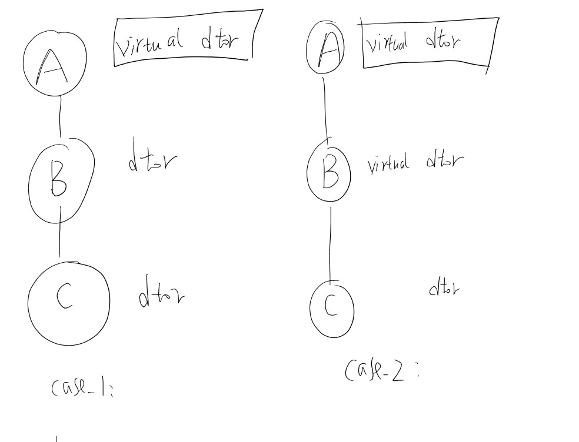
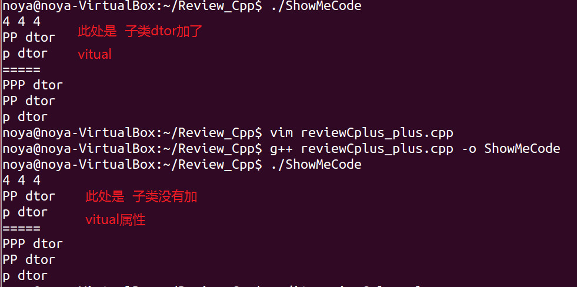

作者：titer1
出处：https://code.csdn.net/titer1
声明：本文采用以下协议进行授权： 自由转载-非商用-非衍生-保持署名|[Creative Commons BY-NC-ND 3.0](http://creativecommons.org/licenses/by-nc-nd/3.0/deed.zh) ，转载请注明作者及出处。

-------
  

c++语法糖系列： virtual析构


- 左右两种情形，子类会调用父类的dtor?
- 不加virtual,子类的类大小尺寸有差别？

```c
#include "stdio.h"

using namespace std;

#define _D //virtual
class P
{
public:
P(){}
virtual ~P(){
	printf("p dtor\n");
}
};

class PP : public P
{
public:
PP(){}
_D ~PP(){
	printf("PP dtor\n");
}

};

class PPP: public PP
{
	public:
	PPP(){}
_D	~PPP()
{
	printf("PPP dtor\n");
		
}

};

int main()
{
printf("%d %d %d \n",sizeof(P), sizeof(PP),sizeof(PPP));
 P * pp= new PP();
 delete pp;

printf("=====\n");
P * p_ppp=new PPP();
delete p_ppp;

return 0;
//vim formate code 
//forget public P
//forget the delete, without delete ,there is nothing show
}
```

#结果


#分析
- 加virtual和不加的子类，大小没有区别，dtor调用行为没有差别。
- 当父类加virtual dtor后，子类可以不用为dtor添加virtual属性
	- 添加后，对dtor的行为无影响
	- 添加后，对于类布局没有影响


