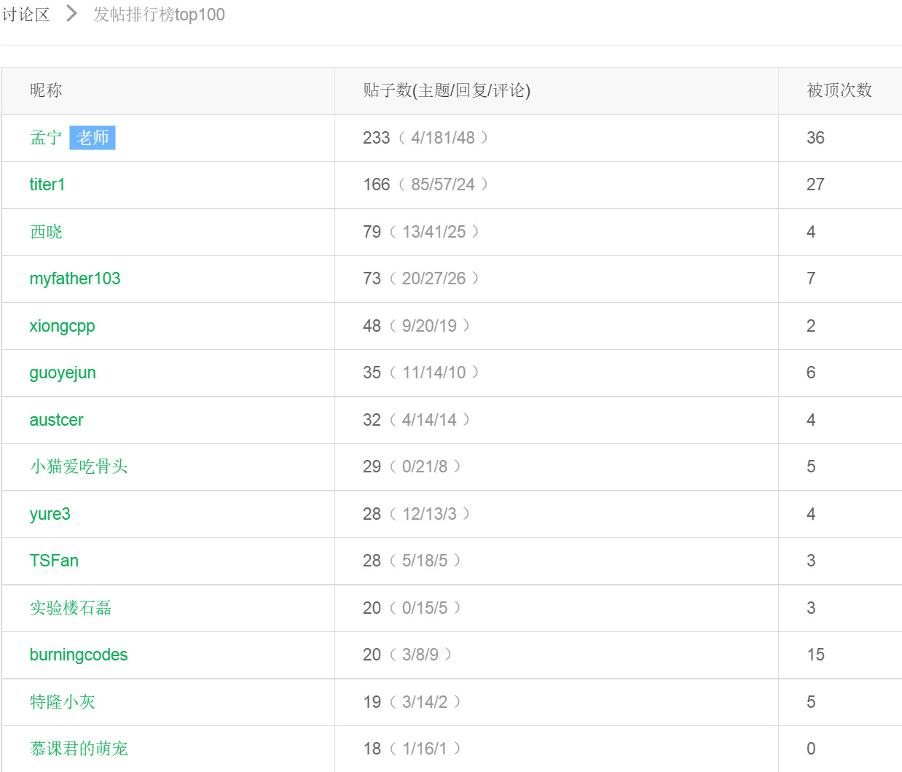

MOOC Linux内核之旅小结
```
刘柳 + 原创作品转载请注明出处 + 《Linux内核分析》MOOC课程http://mooc.study.163.com/course/USTC-1000029000+titer2008@gmail.com+13073161968
```

工作两年，时事变迁，梦碎了一地，幸好还有内核。


#过去的8周
##水过
貌似我的主题帖子数仅此于老师啊，有些帖子质量不高，请大家海涵啊。其实一周就应该两三帖
- 自己遇到的问题
- 自己实践的结果及分析
- 这周比较好的参考资料

##懒过
###时间之伤
第二章的作业竟然忘记了提交，根本原因是周日当天同时跟进2门Mooc，时间错乱了，甚至连链接也没有弄上去。
从这次教训过后，我每周第一件事就是事先填好本周作业的链接，并且把学习时间提前到周六。
```
一个好的时间管理对于mooc学习是非常重要的，
尤其要同时跟进多门Mooc课程，要分清主次轻重缓急
```
###内容之伤
博客的内容，有时老师的板书真的太好了，我就直接摘到博客里面啦，真正消化一章老师的内容，这样做是不可推荐的。
```
为了弥补内容上的不充实，我的临时之计是加上我的实践操作演示+实践总结。不过理论没有深入理解的硬伤依然存在，希望在后续的学习修正之
```

这个小节其实就是我的遗憾之处吧。

##也上进过
  先上图(截至到4月28日），论坛里水过不少，竟然收获了27个赞，谢谢大家。

  此外，收获到3个置顶，(￣▽￣)"，谢谢老师和“慕课君的萌宠”。
  
  话说的我的博客让不少人的浏览器崩掉了，真的不好意思啊！8M的动态演示图真的是浏览器的大杀器，最近几期的演示都放的是超链接，大家完全不用担心啦。
  真的很喜欢这里大家一起讨论内核的气氛
  8周内，有效的学习时间大多数是晚上和大半个周末，每周平均6-8小时（学校里的同学应该比我时间多着）。只能说孟老师的课太有魔力了，竟然坚持下来了。
  
  
#现在

  先给出博客内容不完全列表：
- [动静结合学内核之 linux 系统调用浅析](http://blog.csdn.net/titer1/article/details/44464647)

- [linux 进程调度switch_to宏浅析+系统执行过程总结](http://blog.csdn.net/titer1/article/details/45289159)

- [linux可执行文件创建过程 浅析](http://blog.csdn.net/titer1/article/details/45127543)
- [Linux 进程管理浅析](http://blog.csdn.net/titer1/article/details/44903815)

- [动静结合学内核：linux idle进程和init进程浅析](http://blog.csdn.net/titer1/article/details/44464647)

- [还有两期在网易云笔记中,待转移]


#未来
如果你喜欢linux,我在csdn专栏等你，这里持续更新内核入门学习的心得。
当前这里的专栏把上面所有内容都已经收录
- [linux内核入门实践](http://blog.csdn.net/column/details/kernel-from-scratch.html)


空说无意义，来真的学习计划吧

## linux内核模块学习
   以下是我寻找出的方案，完全可在老师搭建好的实验平台上继续拓展。
   [利用qume调试kernel moudle 教程](http://mooc.study.163.com/learn/USTC-1000029000#/learn/forumdetail?pid=1000155085)
   如果上述方案成功的话，linux driver 那本书的代码都可以在qume平台逐步跟踪啦
   想着可以逐步跟踪ldd3书上的代码，心里还是蛮激动的
   [ldd3 github](https://github.com/martinezjavier/ldd3)

##linux 内存管理机制
  入门的话，先看lkd（robert)的书，再看懂wdy这章图吧
  
  
##linux 中断系统机制
  其实我们学习系统调用的时候，已经中断的脉络走了大半，不过中断可不仅仅是系统调用。
  暂且先留个chinaunix内核版主“瀚海书香”的经典4大中断问题，我还在理解中。
- 1.什么是硬中断，什么是软中断？
- 2.不同的硬中断是否可以嵌套？相同的硬中断是否可以嵌套，以及是否按优先级嵌套？硬中断最多可能嵌套几级？
- 3.不同的软中断是否可以嵌套？相同的软中断是否可以嵌套？
- 4.软中断在什么时间点被调度？
[答案](http://blog.chinaunix.net/uid-20662820-id-3023342.html)

##linux 某一子系统（v4L2)的分析
  工作内容相关，希望得到深入，至少在vediobuf的认识上。
  [v4L2资料分享](http://blog.chinaunix.net/attachment/attach/20/54/36/7220543672a6e6f227f097f8db3fbe3f900c099717.pdf)


#总结
##最大的收获
实践出真知，从来没有看到内核的代码离自己这么的近

##最大的遗憾
自己消化的linux内核理论还不够多


#其他
五一临近，先写了吧，免得后面熬夜加班。希望亲人和朋友们都身体倍棒啊。

怎么这么文艺，“慕课君的萌宠”你好不？貌似还有3周你就要在本论坛里退休啦

#附要求
用自己的话简要总结您对Linux系统的理解及学习Linux内核的心得；
将您之前的所有博客作业做成目录列表，可以修改原博客理解有误或不准确的地方，可以在目录中给每篇博客加个简要引言，总之，您的这篇学习总结博客能为其他学习者提供一个参考索引；


博客内容的具体要求如下：
- 题目自拟，内容围绕您对Linux系统的理解及学习Linux内核的心得进行；
- 将您之前的所有博客作业做成目录列表放在博客中；
	http://blog.csdn.net/column/details/kernel-from-scratch.html
	- 需要把网易云笔记的内容同步
- 总结部分：您在学习《Linux内核分析》课程中最大的收获？
- 学习完《Linux内核分析》课程后您最大的遗憾是什么？

