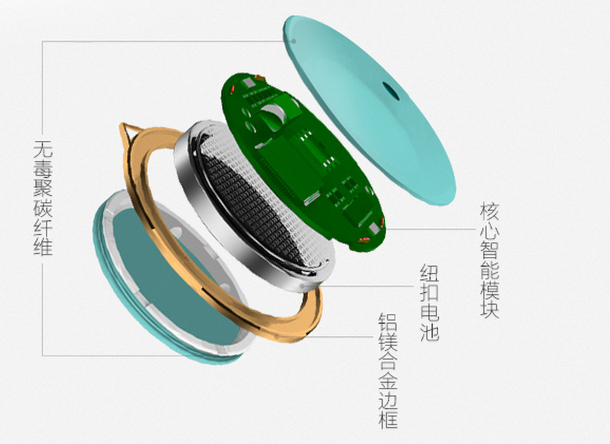

给妈妈过一个科技感十足的母亲节
作为一名工程师，我来个妈妈可用的电子产品介绍吧。

以一个普通母亲的角度来说
- 35岁前生宝宝、照顾宝宝
- 35岁到55岁 养育孩子上学
- 55岁之后 自己的生活 or 照顾孙辈们的生活

这里仅从年龄角度分析母亲需要的智能家电（Arm Powerd）

let go!


#1 baby mother
还记得小时候自己的淘气样吗？


#1.1 体温计
还害怕宝宝打喷嚏吗？想知道宝贝的体温吗？

 电子体温计（耳温枪）出场！

他的内心是ARM Cortex-M喔，(￣▽￣)，喜欢技术的才关心啦


##1.2 尿湿检测器
宝贝尿床了，好久才发现，怎么办啦？

千万不要下面这样啊！！


好吧，妈妈不要烦恼，尿湿检测器出现了

看看科技感的内部，这是不是又是cortex-M啦，o(^▽^)o

想了解这款产品，自己搜索他的广告词就知道了。只能帮到这儿了，没收广告费怎能打广告，继续。

##1.3 智能配奶机
- 半夜宝贝要喝奶，结果花了好长时间，奶都没有配好
- 宝贝在家由老人照看，不过奶粉浓度/温度对他们来说，不好把握
momy,我要喝奶。。

试试下面的配奶机吧，

话说10秒内完成配奶！！保质保量，妈妈再也不担心我喝不到营养的奶啦！
Yeah! 终于可以幸福的喝奶啦，哈哈


#二 mother aged from 35 to 55


- 2.1 智能人体姿势传感器
坐不直，行不正，引发很多问题。你还在不停叫家里的娃挺直吗？

用背背佳吗？You are out.
arm公司在2014年底推荐过这个神器LumoBack。
https://www.kickstarter.com/pages/ARM


```
 LMUOback 是一款智能的检测你背部姿势的装置，不管你是坐着，站着，躺着，甚至走路跑步，睡觉翻身，都能检测出来.
```
有趣吧，熬夜写到这儿，小编（？我是业余写手！！）我买不起如此神器，只能如此伸展一下懒腰，放松一下我的脊椎啊


- 2.2 智能手环/手表
很多人都会想到这个，
列下功能：
	- 计步
    - 统计睡眠
    - 监控坐姿
    - 监控跌倒（当前我比较关注这个）


# 三 mother aged more than 55
主要是医疗相关的
- 3.1 智能拐杖
- 3.2 智能血糖仪


#last


其实，我想要一个大白（医疗机器人“大白”），在妈妈身边多好


其实他就是护理机器人，在日本名古屋已经有了


#其他
用时6个小时，找图好累，如果大家喜欢，就给我点赞吧，谢谢
祝全天下的妈妈 母亲节快乐，祝arm产品更多的改变我们周边的生活！
ok

本贴没有商业目的，不提供产品链接。几乎所有产品都在淘宝众筹有链接，请自行搜索
