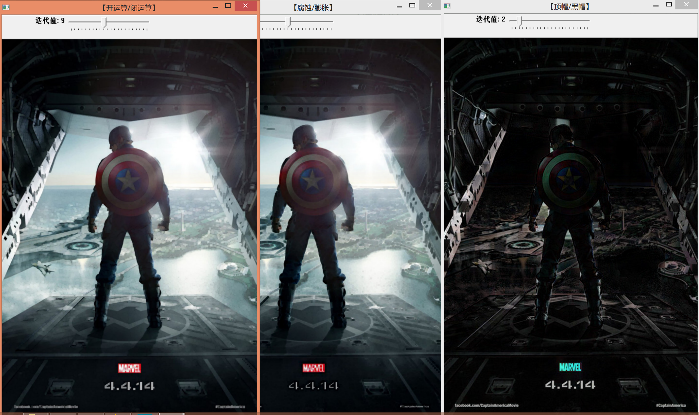

#opencv windows 浅墨的用例实践

##opencv 环境安装
其实就是解决一个sdk的header/lib/dll位置问题

- 头文件在哪里
- lib文件在哪里
- dll在哪里
	- 找不到的话，拷贝所有dll到自己的运行目录

##实例分析
原书有超过100个列子，
集中在第六章，第七章
这里仅从含有“综合”的项目展开

### 线性图像滤波

34 liner filter

### all filter 
Number 37
包括双线性,比其他滤波稳定。

默认参数

修改参数

### 形态学综合
number 48

###漫水填充算法--好玩

###待续

