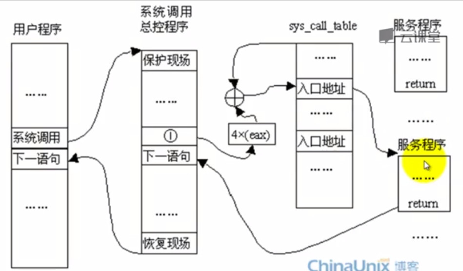

#syscall 4步曲 浅析

简单来说：
系统调用从哪里来
他是如何保护现场的
核心的功能在哪里
他是如何恢复现场的


   


- 1)int 0x80之前
- 2)进入系统调用散转表之前
- 3)iret之前的恢复
- 4）iret之后


   


1)int 0x80之前
2)进入系统调用散转表之前
3）iret之前的恢复
4）iret之后


#最后.思考

##schedule

详情见step2
##击中syscall的断点是line 492 而非line 490 

我认为汇编里特有的宏“.macro ”有对应的调试方法，不过我当前未找到
你的想法啦？

##自己动手添加系统调用


#总结

既然是上下文，必然要来个堆栈的比较


#特色：
用户空间开始
堆栈直观
下一步：
schedule有待


#参考

环境信息

##gcc
```
noya@noya-VirtualBox:/media/sda_m/menu$ gcc -v
gcc version 4.6.3 (Ubuntu/Linaro 4.6.3-1ubuntu5) 

```

##gdb
```
noya@noya-VirtualBox:/media/sda_m/menu$ gdb -v
GNU gdb (Ubuntu/Linaro 7.4-2012.04-0ubuntu2.1) 7.4-2012.04
```

##mykernel
https://github.com/mengning/mykernel


###为entry_32增加符号信息
关键找到makefile 添加 -O0

##gdb tips 

###for chek directory
gdb shell ls

gdb) p /x p->thread.sp0

gdb *0x12345678

(gdb) set logging file gdb.syscall.log
(gdb) set logging on
Copying output to gdb.syscall.log.

##shell 技巧
返回上一次目录
有时候千辛万苦进入了一个很深层的目录，一不小心输入了cd并回车，有什么办法快速回到刚才所在的目录呢？对于bash来说，只需要很管理的一个命令：
cd -
该命令等同于cd $OLDPWD，关于这一点在bash的手册页(可使用命令man bash访问其手册页)中有介绍：
An argument of - is equivalent to $OLDPWD. 
并且它还会返回上一次目录的物理路径。 

