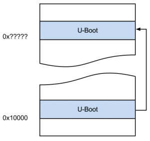

[翻译].调试uboot四部曲.Debugging U-Boot after relocating to RAM

#1. 背景
If some day you find yourself debugging u-boot, or maybe another bootloader, you will probably face a problem when setting breakpoints at some symbols; the application doesn’t stop where you have told the gdb to.
```
调试中可能会遇到设置断点的难题（何时）
```

Bootloaders usually are written to the system’s flash so the microprocessor starts executing there at a specific address and at some point they copy themselves to RAM in order to perform different kind of operations.
```
bootloader 通常被写到flash中，这样cpu就可以在特点地址加载他们。。。
```

Once you have compiled u-boot, the symbol table you have is referenced to the flash starting address where u-boot resides; once it has been relocated to RAM the addresses for these symbols changes too.
```
uboot一旦编译好，那么你的符号表应该指向他放置的位置，比如flash上，或者ram
```

In this post, I am just going to describe a little trick to get the offset used by u-boot to relocate itself when running on QEMU-ARM (versatilepb).
```
通过这篇文章，我将介绍一些技巧，可以得到uboot用于重定位的偏移，辅助环境是qemu-arm
```


#2. 过程分析

First step is building u-boot for QEMU, just grab the latest u-boot’s version and compile it as follows; adding first -ggdb option to config.mk’s PLATFORM_CPPFLAGS variable
```
第一步就是创建一个支持qemu的uboot,
按照以下方法编译uboot
并且在加入-ggdb选项
```

$ make versatilepbqemu_config ARCH=arm CROSS_COMPILE=
$ make

As result you should get several files. Among them, u-boot, containing the whole debugging information, and u-boot.bin, ready to be run on qemu as follows:
```
至此，你获得带有完整符号的uboot
```

$ emu-system-arm -M versatilepb -nographic -kernel u-boot.bin -gdb tcp::3333 -S
This tells qemu to emulate a versatilepb board, to output text on the same terminal, to run u-boot.bin starting at 0x10000 and wait for a gdb connection on the specified port.

```
第二步，启动gdb server
传说的大s 小s,不过这里小s,已经不是1234端口，是3333端口
```

Somewhere else we have to tell gdb to attach to a remote server and set a break at board_init_f(), where u-boot calculates the new offset for later performing the relocation:

```
第三步，得到重定位地址
在board_init_f()设置断点
```

(gdb) file u-boot  
Reading symbols from /home/ggonzalez/Projects/u-boot-lua/u-boot...done.
(gdb) target remote :3333
Remote debugging using :3333
0x00000000 in ?? ()
(gdb) b board_init_f
Breakpoint 1 at 0x10840: file board.c, line 266.
(gdb) c
Continuing.
 
Breakpoint 1, board_init_f (bootflag=0) at board.c:266
266	{
(gdb)
Now that we have reached the desired function we continue executing a few lines forward till we see the line where u-boot calculates the relocation offset:

```
至此，我们已经在期望函数处停下，执行几步，我们可以发现uboot开始计算重定位的位置
```

(gdb) next
440		gd->reloc_off = addr - _TEXT_BASE;
(gdb) p/x (addr - _TEXT_BASE)
$1 = 0x7fb4000
(gdb) p/x addr
$2 = 0x7fc4000

Now we have both the relocation offset and the address where the relocated version of u-boot is going to be placed, this is the one we need for loading again the symbol’s table.
```
至此，我们拿到了重定位的偏移，下一步我们需要重新定位符号表
```

We now discard the current symbols and reload them again using the address we just found. To check everything is working perfectly just set a breakpoint at do_version() which will be reached if you invoke version on u-boot’s shell.
```
第四步，更新符号表
目标是使用 do_version()来验证uboot是否工作正常

```
- symbol-file 放弃以往符号表
- add-symbol-file u-boot 0x7fc4000 加载符号表
- b do_version 设置断点


(gdb) symbol-file  
Discard symbol table from `/home/ggonzalez/Projects/u-boot-lua/u-boot'? (y or n) y
No symbol file now.
(gdb) add-symbol-file u-boot 0x7fc4000
add symbol table from file "u-boot" at
	.text_addr = 0x7fc4000
(y or n) y
Reading symbols from /home/ggonzalez/Projects/u-boot-lua/u-boot...done.
(gdb) b do_version
Breakpoint 2 at 0x7fc79a4: file cmd_version.c, line 32.
(gdb) c
Continuing.
 
Breakpoint 2, do_version (cmdtp=0x7fec0e8, flag=0, argc=1, argv=0x7fa1ec8) at cmd_version.c:32
32	{
(gdb)

#refer 
http://www.gabrielgonzalezgarcia.com/2012/10/28/debugging-u-boot-after-relocating-to-ram-on-arm/
#总结
放下
其实为了控制权的转移，参数传递，基础的初始化，韦东山。
参考了 arm uboot debug +arm要有很多的空间消耗，不过这里初步分析就是emu-system-arm 还有uboot源码而已
