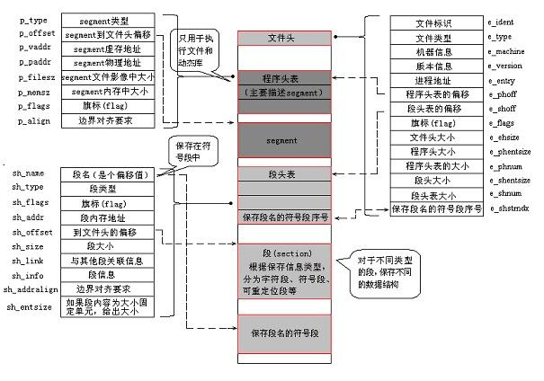
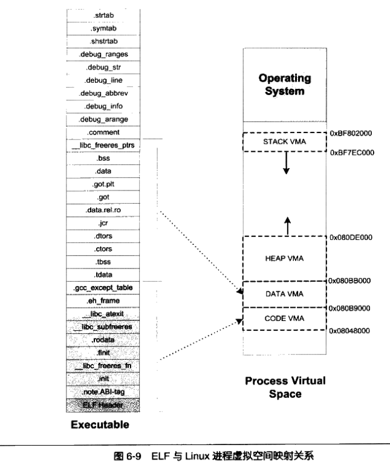
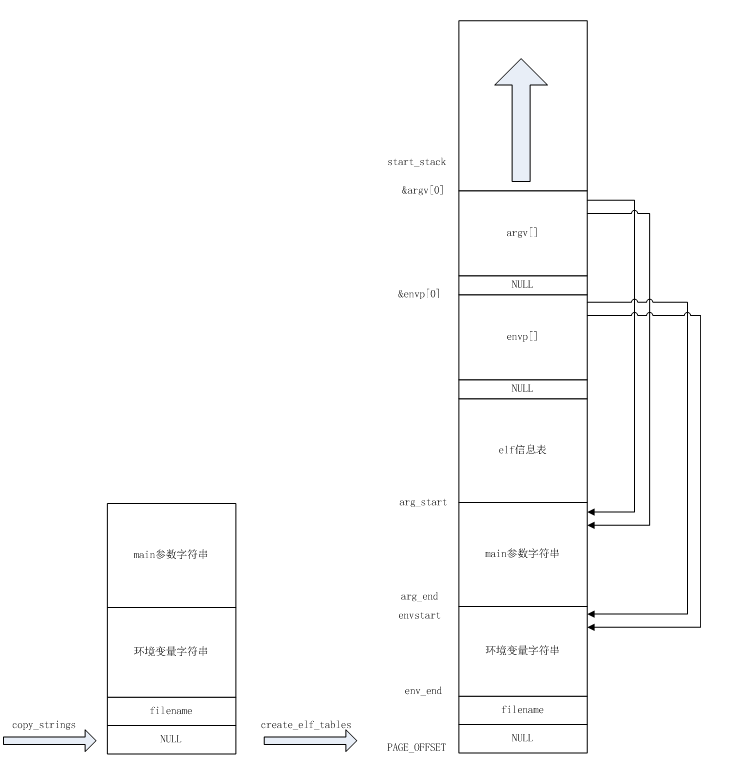

#一. 可执行文件的创建——预处理、编译和链接

#基础

###预处理、编译和链接 实践
```
shiyanlou:~/ $ cd Code                                                [9:27:05]
shiyanlou:Code/ $ vi hello.c                                          [9:27:14]
shiyanlou:Code/ $ gcc -E -o hello.cpp hello.c -m32 #替换宏               
shiyanlou:Code/ $ vi hello.cpp  #可以看到预处理的中间文件                               
shiyanlou:Code/ $ gcc -x cpp-output -S -o hello.s hello.cpp -m32      [9:35:21]
shiyanlou:Code/ $ vi hello.s   #asm code                                    
shiyanlou:Code/ $ gcc -x assembler -c hello.s -o hello.o -m32         [9:35:58]
shiyanlou:Code/ $ vi hello.o   #object code ,binary file                                 
shiyanlou:Code/ $ gcc -o hello hello.o -m32  
shiyanlou:Code/ $ vi hello       #executive file (link dynamic library..)                                                       
shiyanlou:Code/ $ gcc -o hello.static hello.o -m32 -static            [9:40:21]  
                                #executive file (link static library..)    
shiyanlou:Code/ $ ls -l                                                        
-rwxrwxr-x 1 shiyanlou shiyanlou   7292  3\u6708 23 09:39 hello 
 #with dyanmic

-rw-rw-r-- 1 shiyanlou shiyanlou     64  3\u6708 23 09:30 hello.c
-rw-rw-r-- 1 shiyanlou shiyanlou  17302  3\u6708 23 09:35 hello.cpp
-rw-rw-r-- 1 shiyanlou shiyanlou   1020  3\u6708 23 09:38 hello.o
-rw-rw-r-- 1 shiyanlou shiyanlou    470  3\u6708 23 09:35 hello.s

-rwxrwxr-x 1 shiyanlou shiyanlou 733254  3\u6708 23 09:41 hello.static  
 #with static lib ,more space, aoubt 100 times than dyanmic version

```

目标文件及链接
abi 二进制兼容，已经适应某一计算机架构


##ELF文件格式

可以参考ELF文件格式 ：（中文翻译版）,以下是文件格式的概要图（by morphad)
[](http://blog.csdn.net/morphad/article/details/8967000)


 elf共分为三种:
```
一个可重定位(relocatable)文件保存着代码和适当的数据，用来和其他的object文件一起来创建一个可执行文件或者是一个共享文件。
一个可执行(executable)文件保存着一个用来执行的程序；该文件指出了exec(BA_OS)如何来创建程序进程映象。
 一个共享object文件保存着代码和合适的数据，用来被下面的两个链接器链接。第一个是连接编辑器[请参看ld(SD_CMD)]，可以和其他的可重定位和共享object文件来创建其他的object。第二个是动态链接器，联合一个可执行文件和其他的共享object文件来创建一个进程映象。

```


###查看ELF文件的头部
```
shiyanlou:Code/ $ readelf -h hello
```

###静态elf 的进程地址空间



感谢:程序员修养书中图，page 167

当前最基础的是要认识:

- 代码段其实地址： 0x804 8000
- 进程地址空间分布，按照地址递减来看，是 stack->heap->data->code


###查看该ELF文件依赖的共享库
```
shiyanlou:sharelib/ $ ldd main                                       [21:25:56]
    linux-gate.so.1 =>  (0xf774e000) # 这个是vdso - virtual DSO：dynamically shared object，并不存在这个共享库文件，它是内核的一部分，为了解决libc与新版本内核的系统调用不同步的问题，linux-gate.so.1里封装的系统调用与内核支持的系统调用完全匹配，因为它就是内核的一部分嘛。而libc里封装的系统调用与内核并不完全一致，因为它们各自都在版本更新。
    libshlibexample.so => /home/shiyanlou/LinuxKernel/sharelib/libshlibexample.so (0xf7749000)
    libdl.so.2 => /lib32/libdl.so.2 (0xf7734000)
    libc.so.6 => /lib32/libc.so.6 (0xf7588000)
    /lib/ld-linux.so.2 (0xf774f000)
shiyanlou:sharelib/ $ ldd /lib32/libc.so.6                         [21:37:00]
    /lib/ld-linux.so.2 (0xf779e000)
    linux-gate.so.1 =>  (0xf779d000)
```

###查看依赖的so文件
```
shiyanlou:sharelib/ $ readelf -d main                              [21:28:04]
Dynamic section at offset 0xf04 contains 26 entries:
 0x00000001 (NEEDED)                     共享库：[libshlibexample.so]
 0x00000001 (NEEDED)                     共享库：[libdl.so.2]
 0x00000001 (NEEDED)                     共享库：[libc.so.6]
 0x0000000c (INIT)                       0x80484f0
 0x0000000d (FINI)                       0x8048804
 0x00000019 (INIT_ARRAY)                 0x8049ef8
 ```
#二. 可执行程序的执行环境

* 命令行参数和shell环境，一般我们执行一个程序的Shell环境，我们的实验直接使用execve系统调用。
 - $ ls -l /usr/bin 列出/usr/bin下的目录信息
 - Shell本身不限制命令行参数的个数，命令行参数的个数受限于命令自身
   - 例如，int main(int argc, char *argv[])
   - 又如， int main(int argc, char *argv[], char *envp[])
 - Shell会调用execve将命令行参数和环境参数传递给可执行程序的main函数
   - int execve(const char * filename,char * const argv[ ],char * const envp[ ]);
   - 库函数exec*都是execve的封装例程
   
``` c

//keyword /bin/ls execlp functions
#include <stdio.h>
#include <stdlib.h>
#include <unistd.h>
int main(int argc, char * argv[])
{
    int pid;
    /* fork another process */
    pid = fork();
    if (pid<0) 
    { 
        /* error occurred */
        fprintf(stderr,"Fork Failed!");
        exit(-1);
    } 
    else if (pid==0) 
    {
        /*   child process   */
        execlp("/bin/ls","ls",NULL);
    } 
    else 
    {  
        /*     parent process  */
        /* parent will wait for the child to complete*/
        wait(NULL);
        printf("Child Complete!");
        exit(0);
    }
}
```

- 命令行参数和环境串都放在用户态堆栈中

  
  - what:你会看到参数块/环境块的指针
  - who did it: shell->execve->sys_execve在程序初始化的时候把以上环境搭建好的

- 装载时动态链接和运行时动态链接应用举例
动态链接分为可执行程序装载时动态链接和运行时动态链接，如下代码演示了这两种动态链接。

  - 准备.so文件
shlibexample.h (1.3 KB) - Interface of Shared Lib Example
shlibexample.c (1.2 KB) - Implement of Shared Lib Example

  - 编译成libshlibexample.so文件
```
$ gcc -shared shlibexample.c -o libshlibexample.so -m32
```
dllibexample.h (1.3 KB) - Interface of Dynamical Loading Lib Example
dllibexample.c (1.3 KB) - Implement of Dynamical Loading Lib Example

  - 编译成libdllibexample.so文件
```
$ gcc -shared dllibexample.c -o libdllibexample.so -m32 #编译方式和上面一样
```
分别以共享库和动态加载共享库的方式使用libshlibexample.so文件和libdllibexample.so文件
 - main.c  (1.9 KB) - Main program
编译main，注意这里只提供shlibexample的-L（库对应的接口头文件所在目录）和-l（库名，如libshlibexample.so去掉lib和.so的部分），并没有提供dllibexample的相关信息，只是指明了-ldl
```
$ gcc main.c -o main -L/path/to/your/dir -lshlibexample -ldl -m32
$ export LD_LIBRARY_PATH=$PWD #将当前目录加入默认路径，否则main找不到依赖的库文件，当然也可以将库文件copy到默认路径下。
$ ./main
This is a Main program!
Calling SharedLibApi() function of libshlibexample.so!
This is a shared libary!
Calling DynamicalLoadingLibApi() function of libdllibexample.so!
This is a Dynamical Loading libary!
```


#三. 可执行程序的装载
## shell相关
- 命令行参数和shell环境，一般我们执行一个程序的Shell环境，我们的实验直接使用execve系统调用。
Shell本身不限制命令行参数的个数，命令行参数的个数受限于命令自身
  - 例如，int main(int argc, char *argv[])
  - 又如， int main(int argc, char *argv[], char *envp[])
- Shell会调用execve将命令行参数和环境参数传递给可执行程序的main函数
  - int execve(const char * filename,char * const argv[ ],char * const envp[ ]);
  - 库函数exec*都是execve的封装例程

```
小结 参数个数； execv* ->main
```

##sys_execv相关
sys_execve内部会解析可执行文件格式
- do_execve -> do_execve_common ->  exec_binprm


- search_binary_handler符合寻找文件格式对应的解析模块，如下：
```
1369    list_for_each_entry(fmt, &formats, lh) {
1370        if (!try_module_get(fmt->module))
1371            continue;
1372        read_unlock(&binfmt_lock);
1373        bprm->recursion_depth++;
1374        retval = fmt->load_binary(bprm);
1375        read_lock(&binfmt_lock);
```

- 对于ELF格式的可执行文件fmt->load_binary(bprm);执行的应该是load_elf_binary其内部是和ELF文件格式解析的部分需要和ELF文件格式标准结合起来阅读
Linux内核是如何支持多种不同的可执行文件格式的？ 
```
82static struct linux_binfmt elf_format = {
83  .module     = THIS_MODULE,
84  .load_binary    = load_elf_binary,//函数指针
85  .load_shlib = load_elf_library,
86  .core_dump  = elf_core_dump,
87  .min_coredump   = ELF_EXEC_PAGESIZE,
88};
```
```
2198static int __init init_elf_binfmt(void)
2199{
2200    register_binfmt(&elf_format);#注册
2201    return 0;
2202}
```


- elf_format 和 init_elf_binfmt，这里是不是就是观察者模式中的观察者？
```
小结 设计模式 观察者模式 多态
```


##可执行文件开始执行的起点
可执行文件开始执行的起点在哪里？如何才能让execve系统调用返回到用户态时执行新程序？

- 庄生梦蝶 —— 醒来迷惑是庄周梦见了蝴蝶还是蝴蝶梦见了庄周？

- 庄周（调用execve的可执行程序）入睡（调用execve陷入内核），醒来（系统调用execve返回用户态）发现自己是蝴蝶（被execve加载的可执行程序）
```
   (￣▽￣)" 原来都做梦了，睡眠是个好东东；
   睡眠前把sp/ip换掉就进入新的程序，这是我认为的
```
- 修改int 0x80压入内核堆栈的EIP

- load_elf_binary ->  start_thread

```
小结 codes flows: load_elf_binary --> start_thread ;//修改 ip ,sp
```

#四. 动态链接的过程
动态链接的过程内核做了什么？可执行文件依赖的动态链接库（共享库）是由谁负责加载以及如何递归加载的？

###基础
首先要理解elf格式，

会发现： a.so -->b.so...(动态链接库 调用另外一个动态链接库)
```
实践：ldd test
动态链接形成的树
```
##代码
解释的过程，就用到动态解析器，
格式上就要关注 elf 格式中 .interp 和 .dynamic
代码就看load_elf_binary


``` c
load_elf_binary（...)
{
...
kernel_read();//其实就是文件解析
...
//映射到进程空间 0x804 8000地址
elf_map();//
...
if(elf_interpreter) //依赖动态库的话
{...
//装载ld的起点  #获得动态连接器的程序起点
elf_entry=load_elf_interp(...);
...
}
else //静态链接
{...
elf_entry = loc->elf_ex.e_entry;
...
}
...
//static exe: elf_entry: 0x804 8000
//exe with dyanmic lib: elf_entry: ld.so addr
start_thread(regs,elf_entry,bprm->p);

}
```

实际上，装载过程是 一个 bfs ,广度遍历，遍历的对象是
“依赖树”

主要过程是动态链接器（ in libc）完成，用户态完成。
简言之，本次学习最基础就是要知道和静态链接的区别，具体运行过程可以以后专题再深入。

#五. do_execve 代码情景分析
流程是：do_execve -> do_execve_common ->  exec_binprm

##do_execve_common
``` 
fs/exec.c 文件里
可执行程序的装载视频（第二个）详细解释
do_execve //命令行参数填充结构体
do_execve_common
{
...
//打开可执行文件
do_open_exec  
//填充头部
bprm->file = file;
bprem->filename = bprm->interp = filename->name;

//填充环境变量 命令行参数

//关键
execv_binrm(bprm);
...
}
```
##exec_binprm
``` 
static int exec_binprm(struct linux_binprm *bprm)
{
...
//寻找对应可执行文件格式 的 处理函数
search_binary_handle(bprm);
...

}

```
##search_binary_handle
```
int search_binary_handle(struct linux_binprm *bprm)
{
...
//在链表里寻找可解析的方案
list_for_each_entry(fmt, &format, lh);//line 1369

...
}
```
##list_for_each_entry
```
list_for_each_entry(fmt, &formats, lh){
...
//加载可执行文件的处理函数
//实际是load_elf_binary for elf
retval = fmt->load_binary(bprm);
...
}
```

##load_elf_binary
```
//此前可以关注 elf_format结构体内的赋值
//这个结构体被放到链表里面，可以看作是观察者模式/多态的应用
//初始化也有对应的api

load_elf_binary（...)
{
...
kernel_read();//其实就是文件解析
...
//映射到进程空间 0x804 8000地址
elf_map();//
...
if(elf_interpreter) //依赖动态库的话
{...
//装载ld的起点
elf_entry=load_elf_interp(...);
...
}
else //静态链接
{...
elf_entry = loc->elf_ex.e_entry;
...
}
...
//static exe: elf_entry: 0x804 8000
//exe with dyanmic lib: elf_entry: ld.so addr
start_thread(regs,elf_entry,bprm->p);
...


}

```
##整体流程图
谢谢ma89481508的精心制作，访问原帖请点击图片
[](http://blog.csdn.net/ma89481508/article/details/8996436)

图中有轻重的说明了execve--> do——execve --> search_binary_handle --> load_binary流程

##最后奉上一张堆栈变化图
谢谢morphad的精心制作，访问原帖请点击图片
[](http://blog.csdn.net/morphad/article/details/8967000)


图中对于参数块和环境块如何被传到新进程是很好的说明


#六. 实践 gdb跟踪sys_execve
## 调试前的准备

```
#command work flow
rm menu -f
git clone
cd menu
ls
mv test_exec.c test.c 
vim test.c #you will see a new function:Exec
#execlp will be called
```
```
#Makefile update
add hello and init into the rootfs
```
## 大小s来相会,开启调试模式

主要的断点
```
#breakpoint : info b
b sys_execve #fs/exec.c
b load_elf_binary #fs/binfmt_elf.c
b start_thread
```

## 跟踪过程
load_elf_binary 第一个被击中，ignore it
进入系统，输入exec，sys_execve被击中

```
debug work flow:
sys_execve -> load_elf_binary ->start_thread

```

当跟踪到start_thread时，查看new_ip执行位置,new_ip是返回用户空间执行的函数地址，键入以下命令：

```
gdb中：     po new_ip #查看内容
主机命令行： read_elf -h hello
```
对比程序入口地址和 new_ip 指向地址一致！
new_ip对于静态链接程序来说，就是真实的地址。


#七. 参考 本周要求
- Linux内核如何装载和启动一个可执行程序
理解编译链接的过程和ELF可执行文件格式，详细内容参考本周第一节；

- 编程使用exec*库函数加载一个可执行文件，动态链接分为可执行程序装载时动态链接和运行时动态链接，编程练习动态链接库的这两种使用方式，详细内容参考本周第二节；

- 使用gdb跟踪分析一个execve系统调用内核处理函数sys_execve ，验证您对Linux系统加载可执行程序所需处理过程的理解，详细内容参考本周第三节；

- 特别关注新的可执行程序是从哪里开始执行的？
为什么execve系统调用返回后新的可执行程序能顺利执行？
对于静态链接的可执行程序和动态链接的可执行程序execve系统调用返回时会有什么不同？
 ```
（重点）
 ```

- 根据本周所学知识分析
 ```
exec*函数对应的系统调用处理过程
 ```
，撰写一篇署名博客，并在博客文章中注明“真实姓名（与最后申请证书的姓名务必一致） + 原创作品转载请注明出处 + 《Linux内核分析》MOOC课程http://mooc.study.163.com/course/USTC-1000029000 ”，博客内容的具体要求如下：

1. 题目自拟，内容围绕对Linux内核如何装载和启动一个可执行程序；
2. 可以结合实验截图、ELF可执行文件格式、用户态的相关代码等；
3. 博客内容中需要仔细分析新可执行程序的执行起点及对应的堆栈状态等。
4. 总结部分需要阐明自己对“Linux内核装载和启动一个可执行程序”的理解

``
小结：截图，代码，堆栈，起点，总结
有趣的-L -l 链接共享库
``
# 其他
thanks haroopad ;chrome based opensource editor
to find qt based opensource editor
共享库代码
(week7_args.png "" "width:30px;float:right")恢复大小

fork vs execve
fs/exec.c 文件 符号表
番茄计时：1.5小时 完成 section 1 2,  4小时 完成剩余section
#参考
http://blog.csdn.net/ma89481508/article/details/8996436
http://blog.csdn.net/morphad/article/details/8967000
