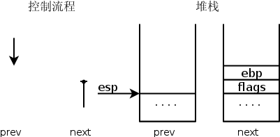
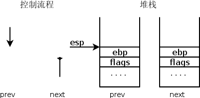
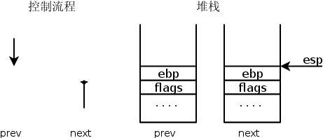
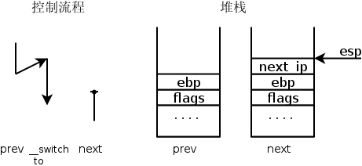
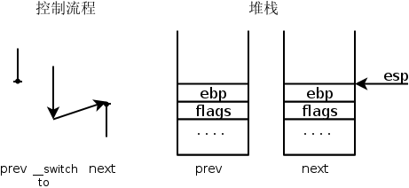
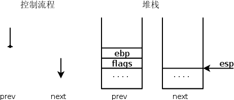

```
刘柳 + 原创作品转载请注明出处 + 《Linux内核分析》MOOC课程+http://mooc.study.163.com/course/USTC-1000029000+titer2008@gmail.com
```

# 进程的调度时机与进程的切换

操作系统原理中介绍了大量进程调度算法，这些算法从实现的角度看仅仅是从运行队列中选择一个新进程，选择的过程中运用了不同的策略而已。
对于理解操作系统的工作机制，反而是进程的调度时机与进程的切换机制更为关键。

# 调度时机 背景
- 不同类型的进程有不同的调度需求
- 第一种分类：
	- I/O-bound
		- 频繁的进行I/O
		- 通常会花费很多时间等待I/O操作的完成
	- CPU-bound
		- 计算密集型
		- 需要大量的CPU时间进行运算
- 第二种分类
	- 批处理进程（batch process）
		- 不必与用户交互，通常在后台运行
		- 不必很快响应
		- 典型的批处理程序：编译程序、科学计算
	- 实时进程（real-time process）
		- 有实时需求，不应被低优先级的进程阻塞
		- 响应时间要短、要稳定
		- 典型的实时进程：视频/音频、机械控制等
	- 交互式进程（interactive process）
		- 需要经常与用户交互，因此要花很多时间等待用户输入操作
		- 响应时间要快，平均延迟要低于50~150ms
		- 典型的交互式程序：shell、文本编辑程序、图形应用程序等

# Linux中的进程调度
- Linux既支持普通的分时进程，也支持实时进程
- Linux中的调度是多种调度策略和调度算法的混合。
- 什么是调度策略？
	- 是一组规则，它们决定什么时候以怎样的方式选择一个新进程运行
- Linux的调度基于分时和优先级
	- 随着版本的变化，分时技术在不断变化

- Linux的进程根据优先级排队
	- 根据特定的算法计算出进程的优先级，用一个值表示
	- 这个值表示把进程如何适当的分配给CPU
- Linux中进程的优先级是动态的
	- 调度程序会根据进程的行为周期性的调整进程的优先级
		- 较长时间未分配到CPU的进程，通常↑
		- 已经在CPU上运行了较长时间的进程，通常↓

# 相关的系统调用
nice
getpriority/setpriority
sched_getscheduler/sched_setscheduler
sched_getparam/sched_setparam
sched_yield
sched_get_priority_min/sched_get_priority_max
sched_rr_get_interval

# scheudle 函数
- schedule函数实现调度
- 目的：在运行队列中找到一个进程，把CPU分配给它
- 调用方法：
	- 直接调用，如sleep_on
	- 松散调用，根据need_resched标记


#进程调度的时机（重点）
- 中断处理过程（包括时钟中断、I/O中断、系统调用和异常）中，直接调用schedule()，或者返回用户态时根据 need_resched 标记调用schedule()；
- 内核线程可以直接调用schedule()进行进程切换，也可以在中断处理过程中进行调度，也就是说内核线程作为一类的特殊的进程可以主动调度，也可以被动调度；
- 用户态进程无法实现主动调度，仅能通过陷入内核态后的某个时机点进行调度，即在中断处理过程中进行调度。

```
用户态被动调度
内核线程只有内核态没有用户态的特殊进程，无需系统调用。

插曲：张银奎说程序进入内核态犹如人睡觉啦。这个笑话很有意思
```


# 进程的切换
为了控制进程的执行，内核必须有能力挂起正在CPU上执行的进程，并恢复以前挂起的某个进程的执行，这叫做进程切换、任务切换、上下文切换；

- 挂起正在CPU上执行的进程，与中断时保存现场是不同的，中断前后是在同一个进程上下文中，只是由用户态转向内核态执行；
```
区别是否是同一个进程
```
- 进程上下文包含了进程执行需要的所有信息
	- 用户地址空间：包括程序代码，数据，用户堆栈等
	- 控制信息：进程描述符，内核堆栈等
	- 硬件上下文（注意中断也要保存硬件上下文只是保存的方法不同）
```
还有硬件上下文
```

- schedule()函数选择一个新的进程来运行，并调用context_switch进行上下文的切换，这个宏调用switch_to来进行关键上下文切换
	- next = pick_next_task(rq, prev);//进程调度算法都封装这个函数内部
	- context_switch(rq, prev, next);//进程上下文切换
	- switch_to利用了prev和next两个参数：prev指向当前进程，next指向被调度的进程


#进程代码切换代码分析（重点）
第一节第二堂课

位置：kernel/sched/core.c 
```
如果想看到这里面详细的值，可以使用gcc -O0试试
```

以下是scheudle代码的展开结构图（感谢tldp供图），从中可以得到
switch_to的具体调用位置和具体汇编内容的分工。
```
|schedule
   |do_softirq // manages post-IRQ work
   |for each task
      |calculate counter
   |prepare_to__switch // does anything
   |switch_mm // change Memory context (change CR3 value)
   |switch_to (assembler)
      |SAVE ESP
      |RESTORE future_ESP
      |SAVE EIP
      |push future_EIP *** push parameter as we did a call 
         |jmp __switch_to (it does some TSS work) 
         |__switch_to()
          ..
         |ret *** ret from call using future_EIP in place of call address
      new_task


```

从进程的角度看，我们可以得到如下的控制流程图，大家可以从tldp这张图里面知道
两个不同进程如何进行切换的。

```
  U S E R   M O D E                 K E R N E L     M O D E
 |          |     |          |       |          |     |          |
 |          |     |          | Timer |          |     |          |
 |          |     |  Normal  |  IRQ  |          |     |          |
 |          |     |   Exec   |------>|Timer_Int.|     |          |
 |          |     |     |    |       | ..       |     |          |
 |          |     |    \|/   |       |schedule()|     | Task1 Ret|
 |          |     |          |       |_switch_to|<--  |  Address |
 |__________|     |__________|       |          |  |  |          |
                                     |          |  |S |          | 
Task1 Data/Stack   Task1 Code        |          |  |w |          |
                                     |          | T|i |          |
                                     |          | a|t |          |
 |          |     |          |       |          | s|c |          |
 |          |     |          | Timer |          | k|h |          |
 |          |     |  Normal  |  IRQ  |          |  |i |          | 
 |          |     |   Exec   |------>|Timer_Int.|  |n |          |
 |          |     |     |    |       | ..       |  |g |          |
 |          |     |    \|/   |       |schedule()|  |  | Task2 Ret|
 |          |     |          |       |_switch_to|<--  |  Address |
 |__________|     |__________|       |__________|     |__________|
 
Task2 Data/Stack   Task2 Code        Kernel Code  Kernel Data/Stack

```

##关于switch_to 中esp eip 切换的认识
	- esp 先切换
	- eip 再切换
	- 利用push eip +call 起到了类似的call 作用，但是灵活修改了eip 。
	/*这点很牛*/
##代码情景分析+gdb动手实践
```
#define switch_to(prev, next, last)                                     \
do {                                                                    \
        /*                                                              \
         * Context-switching clobbers all registers, so we clobber      \
         * them explicitly, via unused output variables.                \
         * (EAX and EBP is not listed because EBP is saved/restored     \
         * explicitly for wchan access and EAX is the return value of   \
         * __switch_to())                                               \
         */                                                             \
        unsigned long ebx, ecx, edx, esi, edi;                          \
                                                                        \
        asm volatile("pushfl\n\t"               /* save    flags */     \
                     "pushl %%ebp\n\t"          /* save    EBP   */     \
                     "movl %%esp,%[prev_sp]\n\t"        /* save    ESP   */ \
                     "movl %[next_sp],%%esp\n\t"        /* restore ESP   */ \
                     "movl $1f,%[prev_ip]\n\t"  /* save    EIP   */     \
                     "pushl %[next_ip]\n\t"     /* restore EIP   */     \
                     "jmp __switch_to\n"        /* regparm call  */     \
                     "1:\t"                                             \
                     "popl %%ebp\n\t"           /* restore EBP   */     \
                     "popfl\n"                  /* restore flags */     \
                                                                        \
                     /* output parameters */                            \
                     : [prev_sp] "=m" (prev->thread.sp),                \
                       [prev_ip] "=m" (prev->thread.ip),                \
                       "=a" (last),                                     \
                                                                        \
                       /* clobbered output registers: */                \
                       "=b" (ebx), "=c" (ecx), "=d" (edx),              \
                       "=S" (esi), "=D" (edi)                           \
                                                                        \
                       /* input parameters: */                          \
                     : [next_sp]  "m" (next->thread.sp),                \
                       [next_ip]  "m" (next->thread.ip),                \
                                                                        \
                       /* regparm parameters for __switch_to(): */      \
                       [prev]     "a" (prev),                           \
                       [next]     "d" (next));                          \
} while (0)
```

```
欢迎大家到我的博客留言，希望成为内核入门学习的干货店。
http://blog.csdn.net/titer1/
```

仅仅演示swith_to堆栈变化，
要知道哪些地方典型的调用schedule,待下一次展开
鉴于switch_to是一个宏，我们使用下面的方法设置断点：

```
b kernel/sched/core.c:2373
```

感谢hchunhui供图，
```
他的博客可以从这里访问：
http://home.ustc.edu.cn/~hchunhui/linux_sched.html
```

### 1 switch_to之前

###2 切换堆栈之前

###3 切换堆栈之后

###4 push和Jump操作之后

###5 _switch_to汇编返回

###6 switch_to完成



#Linux系统的一般执行过程
位置：教程第二节第一讲

最一般的情况：正在运行的用户态进程X切换到运行用户态进程Y的过程

1. 在运行的用户态进程X 发生中断，硬件完成以下：
	- save cs:eip/esp/eflags(current) to kernel stack
    - load cs:eip(entry of a specific ISR) and ss:esp(point to kernel stack).

   
3. SAVE_ALL //保存现场
4. 中断处理过程中或中断返回前调用了schedule()，其中的switch_to做了关键的进程上下文切换

5. 标号1之后开始运行用户态进程Y(这里Y曾经通过以上步骤被切换出去过因此可以从标号1继续执行)  
```
已经变成Y进程上下文，真是 庄周做梦
```
6. restore_all //恢复现场
7. iret - pop cs:eip/ss:esp/eflags from kernel stack
8. 继续运行用户态进程Y

#进程间的 几种特殊情况
```
先普通 再特殊
```

- 通过中断处理过程中的调度时机，用户态进程与内核线程之间互相切换和内核线程之间互相切换，与最一般的情况非常类似，只是内核线程运行过程中发生中断没有进程用户态和内核态的转换；
```
2个内核线程之间切换，cs段没有改变我
用户进程和内核线程间切换
```
- 内核线程主动调用schedule()，只有进程上下文的切换，没有发生中断上下文的切换，与最一般的情况略简略；
```
没有发生中断，也就是没有int 指令和iret指令喔，
```
- 创建子进程的系统调用在子进程中的执行起点及返回用户态，如fork；
```
pre :parent
next: child
so next_ip =ret_from_fork ,不是switch_to中的标号1喔
```
- 加载一个新的可执行程序后返回到用户态的情况，如execve；
```
pre：parent
next:execve产生的进程（记住，execve也是系统调用）
联想start_thread(execve内部）,里面有修改进程上下文的内容喔，所以以新的中断上下文返回
```

#开眼界 内核 舞女 
```
dancing girls vs Taxi girl
```
0-3g 
3g-4g 内核态
如果每个进程都有自己的内核栈，如何切换？
```
原因是：内核态下(3G以上空间），各进程的代码段/堆栈段是可以统一访问的
借用老师的话：内核是taxi

内核是什么？
内核是各种中断处理过程和内核线程的集合！ 精炼啊 大道至简 道法自然
```

# Linux操作系统架构和系统执行过程概览 

##操作系统的基本概念
♦ 任何计算机系统都包含一个基本的程序集 合，称为操作系统。
– 内核（进程管理，进程调度，进程间通讯机 制，内存管理，中断异常处理，文件系统，I/O 系统，网络部分） 
– 其他程序（例如函数库、shell程序、系统程序 等等）
♦ 操作系统的目的
– 与硬件交互，管理所有的硬件资源 
– 为用户程序（应用程序）提供一个良好的执行 环境


##典型的Linux操作系统的结构
围绕系统架构图

## 最简单也是最复杂的操作
ls 命令 就是 一讲！ 不简单
```
有时间的话 可以看看strace
```

##换个角度 cpu执行指令 +内存角度看
某种程度上说，
cpu执行指令的演示很精彩
后者就是在说进程地址空间

#总结
调度简单说来就是控制权的转移，复杂的话就要考量，主要是
- 什么时候切换
- 选择哪些进程切换
具体的调度方法根据应用场景来分 就是 调度策略。

了解schedule函数是分析进程调度的基础，后续可以从O(1)，cfs等进行扩展学习。


# 本章要求 理解进程调度时机跟踪分析进程调度与进程切换的过程
- 理解Linux系统中进程调度的时机，可以在内核代码中搜索schedule()函数，看都是哪里调用了schedule()，判断我们课程内容中的总结是否准确；

```
验证
```
- 使用gdb跟踪分析一个schedule()函数 ，验证您对Linux系统进程调度与进程切换过程的理解；推荐在实验楼Linux虚拟机环境下完成实验。

- 特别关注并仔细分析switch_to中的汇编代码，理解进程上下文的切换机制，以及与中断上下文切换的关系；

根据本周所学知识分析并理解Linux中进程调度与进程切换过程，撰写一篇署名博客，并在博客文章中注明“真实姓名（与最后申请证书的姓名务必一致） + 原创作品转载请注明出处 + 《Linux内核分析》MOOC课程http://mooc.study.163.com/course/USTC-1000029000 ”，博客内容的具体要求如下：
题目自拟，内容围绕对进程调度的时机和进程切换进行；
可以结合关键代码、实验截图、堆栈状态、CPU寄存器状态等；
博客内容中需要仔细分析进程的调度时机、switch_to及对应的堆栈状态等。
总结部分需要阐明自己对“Linux系统一般执行过程”的理解

#其他
可以找到一个ppt 讲 switch_to ,看寄存器变化吗？
mykernel其实就是一个简化版本的switch


