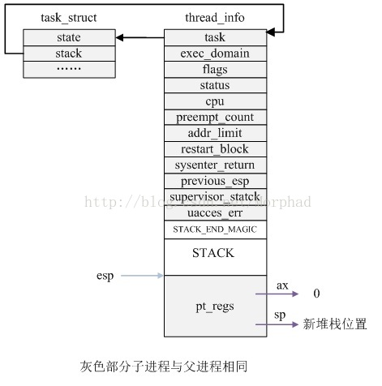

#进程的描述
##ulk那个大图 for task_struct
   提纲挈领，看代码前总览
   


##序言 进程控制块PCB——task_struct

为了管理进程，内核必须对每个进程进行清晰的描述，进程描述符提供了内核所需了解的进程信息。

```

struct task_struct数据结构很庞大
```

  

 Linux进程的状态与操作系统原理中的描述的进程状态似乎有所不同，比如就绪状态和运行状态都是TASK_RUNNING，为什么呢？
    A66：取决于是否获得cpu的控制权

##进程的标示pid
  每个进程唯一的标示

##调度相关的
  核心关键词有：
  runqueue
  优先级
  抢占
  调度信息

```

struct task_struct {

...
	int on_rq;

	int prio, static_prio, normal_prio;
	unsigned int rt_priority;
	const struct sched_class *sched_class;
	struct sched_entity se;
	struct sched_rt_entity rt;
...
	struct sched_dl_entity dl;

...

	unsigned int policy;
	int nr_cpus_allowed;
	cpumask_t cpus_allowed;

#ifdef CONFIG_PREEMPT_RCU
	int rcu_read_lock_nesting;
	union rcu_special rcu_read_unlock_special;
	struct list_head rcu_node_entry;
#endif /* #ifdef CONFIG_PREEMPT_RCU */

#ifdef CONFIG_TREE_PREEMPT_RCU
	struct rcu_node *rcu_blocked_node;
#endif /* #ifdef CONFIG_TREE_PREEMPT_RCU */
#ifdef CONFIG_TASKS_RCU
	unsigned long rcu_tasks_nvcsw;
	bool rcu_tasks_holdout;
	struct list_head rcu_tasks_holdout_list;
	int rcu_tasks_idle_cpu;
#endif /* #ifdef CONFIG_TASKS_RCU */

#if defined(CONFIG_SCHEDSTATS) || defined(CONFIG_TASK_DELAY_ACCT)
	struct sched_info sched_info;
#endif

...
}

```


##所有进程链表struct list_head tasks;

```

```


##内核的双向循环链表的实现方法 - 一个更简略的双向循环链表
   独立操作


##父子关系
程序创建的进程具有父子关系，在编程时往往需要引用这样的父子关系。进程描述符中有几个域用来表示这样的关系


```

/*
	 * pointers to (original) parent process, youngest child, younger sibling,
	 * older sibling, respectively.  (p->father can be replaced with
	 * p->real_parent->pid)
	 */
	struct task_struct __rcu *real_parent; /* real parent process */
	struct task_struct __rcu *parent; /* recipient of SIGCHLD, wait4() reports */
	/*
	 * children/sibling forms the list of my natural children
	 */
	struct list_head children;	/* list of my children */
	struct list_head sibling;	/* linkage in my parent's children list */
	struct task_struct *group_leader;	/* threadgroup leader */

```

##mm_struct
  非本章重点，待后面章节展开，
  linux进程的地址空间，是个有趣的话题

##cpu相关
   与我们menuos相关的，注意其中sp/ip指针。

```
struct thread_struct {
	/* Cached TLS descriptors: */
	struct desc_struct	tls_array[GDT_ENTRY_TLS_ENTRIES];

	unsigned long		sp0;
	unsigned long		sp;

#ifdef CONFIG_X86_32
	unsigned long		sysenter_cs;
#else
	unsigned long		usersp;	/* Copy from PDA */
	unsigned short		es;
	unsigned short		ds;
	unsigned short		fsindex;
	unsigned short		gsindex;
#endif

#ifdef CONFIG_X86_32
	unsigned long		ip;
#endif
...
}

```

至此，400行左右的task_struct大致介绍到此


##内存区域
- Linux为每个进程分配一个8KB大小的内存区域，用于存放该进程两个不同的数据结构：Thread_info和进程的内核堆栈

- 进程处于内核态时使用，不同于用户态堆栈，即PCB中指定了内核栈，那为什么PCB中没有用户态堆栈？用户态堆栈是怎么设定的？

http://mooc.study.163.com/learn/USTC-1000029000#/learn/forumdetail?pid=1000135065

- 内核控制路径所用的堆栈很少，因此对栈和Thread_info来说，8KB足够了

- struct thread_struct thread;?//CPU-specific state of this task

- 文件系统和文件描述符


##内存管理——进程的地址空间
   不深入mmu


---
#二. 进程的创建

##回顾
start_kernel --->
kernel_init --->
kthreadd

##fork一个子进程的代码
```c
#include <stdio.h>
#include <stdlib.h>
#include <unistd.h>
int main(int argc, char * argv[])
{
    int pid;
    /* fork another process */
    pid = fork();//核心调用
    if (pid < 0) 
    { 
        /* error occurred */
        fprintf(stderr,"Fork Failed!");
        exit(-1);
    } 
    else if (pid == 0) 
    {
        /* child process */
        printf("This is Child Process!\n");
    } 
    else 
    {  
        /* parent process  */
        printf("This is Parent Process!\n");
        /* parent will wait for the child to complete*/
        wait(NULL);
        printf("Child Complete!\n");
    }
}
```
##系统调用回顾
  不仅仅是调用一个fork


int 0x80和iret的一个配合


试问fork进程的来源？我们来看下文

##新进程创建三部曲
  创建一个新进程在内核中的执行过程是（sys_clone-->do_fork)
fork、vfork和clone三个系统调用都可以创建一个新进程，而且都是通过调用do_fork来实现进程的创建；

Linux通过复制父进程来创建一个新进程，那么这就给我们理解这一个过程提供一个想象的框架：


###step1: 复制一个PCB——task_struct


```
err = arch_dup_task_struct(tsk, orig);

```

###step2:要给新进程分配一个新的内核堆栈

```
ti = alloc_thread_info_node(tsk, node);
tsk->stack = ti;
setup_thread_stack(tsk, orig); //这里只是复制thread_info，而非复制内核堆栈

```

要修改复制过来的进程数据，比如pid、进程链表等等都要改改吧，见copy_process内部。
从用户态的代码看fork();函数返回了两次，即在父子进程中各返回一次，父进程从系统调用中返回比较容易理解，子进程从系统调用中返回，那它在系统调用处理过程中的哪里开始执行的呢？这就涉及子进程的内核堆栈数据状态和task_struct中thread记录的sp和ip的一致性问题，这是在哪里设定的？copy_thread in copy_process


###step3:进程数据的修改

```
*childregs = *current_pt_regs(); //复制内核堆栈
childregs->ax = 0; //为什么子进程的fork返回0，这里就是原因！
 
p->thread.sp = (unsigned long) childregs; //调度到子进程时的内核栈顶
p->thread.ip = (unsigned long) ret_from_fork; //调度到子进程时的第一条指令地址

```


以上是老师给我们讲解的框架，后面将展开。


##代码情景分析


fork.c
do_fork -->copy_process-->dup_task_struct
  
###dup_task_struct


```
 {
   alloc_task_sturct //slab管理 task_stuct...
   alloc_thread_info //keme_pages
   stack
   
   }

```
###copy_thread
do_fork -->copy_process-->dup_task_struct
  --->子进程初始化（很多）-->copy_thread


```
copy_thread{
sp指针
内核堆栈数据拷贝(重点展开）

}

```


附图


这里感谢作者morphad的制图http://blog.csdn.net/morphad/article/details/9202107


```
  childregs->ax=0;
```
这里看到返回值(pid)赋值的位置


###子进程启动位置
  本质原因是ret_from_fork

先展开pt_regs内容，这也是int指令和save_all压到堆栈的内容


```c
struct pt_regs {
	long ebx;
	long ecx;
	long edx;
	long esi;
	long edi;
	long ebp;
	long eax;
	int  xds;
	int  xes;
	int  xfs;
	int  xgs;
	long orig_eax;
	long eip;
	int  xcs;
	long eflags;
	long esp;
	int  xss;
};
```
以系统调用位列，ax为调用号。

展开ret_from_fork

```
ENTRY(ret_from_fork)


	movi	a4, schedule_tail
	callx4	a4

	movi	a4, do_syscall_trace_leave
	mov	a6, a1
	callx4	a4

	j	common_exception_return

ENDPROC(ret_from_fork)
...


```

展开syscall_exit

```
syscall_exit:
	LOCKDEP_SYS_EXIT
	DISABLE_INTERRUPTS(CLBR_ANY)	# make sure we don't miss an interrupt
					# setting need_resched or sigpending
					# between sampling and the iret
	TRACE_IRQS_OFF
	movl TI_flags(%ebp), %ecx
	testl $_TIF_ALLWORK_MASK, %ecx	# current->work
	jne syscall_exit_work

restore_all:
	TRACE_IRQS_IRET
```


以后的流程其实就是上节课的内容啦


###子进程返回用户态之前会发生系统调用吗？
  个人认为，会。


###来一个大总结吧，上流程图，
 
Detail please refer to  "professional_linux_kernel_architecture.pdf" page 67

 

其中标示为灰色块的功能需要关注


#三.动手实验
- rm menu
- git clone
- mv test_fork.c test.c
- make rootfs

now, enjoy the work see the "fork"


the information to debug

- sys_clone
- do_fork
- dup_task_struct
- copy_process
- copy_thread
- ret_from_fork (*)

the result of debugging


```（等到截图产生再更新）
- copy_process
  alloc_thread_info
  arc_dup_task_struct
 
  setup_thread_stack
- copy_thread
  childregs //ptype
  current_pt_regs()//前后堆栈变化
  ip
- ret_from_fork 
   //step by step
  不跟踪schedule,continue

- syscall_exit (直到这个位置）

```
 
#用户空间代码情景分析

这里使用c和汇编对照分析的方法，
有了objdump，再也不怕看汇编啦，(￣▽￣)"。

```
0804a1c6 <Fork>:

int Fork(int argc, char *argv[])
{
 804a1c6:	55                   	push   %ebp
 804a1c7:	89 e5                	mov    %esp,%ebp
 804a1c9:	83 ec 28             	sub    $0x28,%esp
	int pid;
	printf("titer 1 get addr:%x\n",Fork);
 804a1cc:	b8 52 e2 0c 08       	mov    $0x80ce252,%eax
 804a1d1:	c7 44 24 04 c6 a1 04 	movl   $0x804a1c6,0x4(%esp)
 804a1d8:	08 
 804a1d9:	89 04 24             	mov    %eax,(%esp)
 804a1dc:	e8 af e6 00 00       	call   8058890 <_IO_printf>
	/* fork another process */
	pid = fork(); 
 804a1e1:	e8 ea 0e 00 00       	call   804b0d0 <__fork>
 804a1e6:	89 45 f4             	mov    %eax,-0xc(%ebp)
	if (pid<0) #我们将在这里设断点
 804a1e9:	83 7d f4 00          	cmpl   $0x0,-0xc(%ebp)
 804a1ed:	79 34                	jns    804a223 <Fork+0x5d>
	{ 
		/* error occurred */
		fprintf(stderr,"Fork Failed!");
 804a1ef:	a1 fc a8 0f 08       	mov    0x80fa8fc,%eax
 804a1f4:	89 c2                	mov    %eax,%edx
 804a1f6:	b8 67 e2 0c 08       	mov    $0x80ce267,%eax
 804a1fb:	89 54 24 0c          	mov    %edx,0xc(%esp)
 804a1ff:	c7 44 24 08 0c 00 00 	movl   $0xc,0x8(%esp)
 804a206:	00 
 804a207:	c7 44 24 04 01 00 00 	movl   $0x1,0x4(%esp)
 804a20e:	00 
 804a20f:	89 04 24             	mov    %eax,(%esp)
 804a212:	e8 89 ed 00 00       	call   8058fa0 <_IO_fwrite>
		exit(-1);
 804a217:	c7 04 24 ff ff ff ff 	movl   $0xffffffff,(%esp)
 804a21e:	e8 8d dc 00 00       	call   8057eb0 <exit>
	} 
	else if (pid==0) 
 804a223:	83 7d f4 00          	cmpl   $0x0,-0xc(%ebp)
 804a227:	75 0e                	jne    804a237 <Fork+0x71>
	{
		/*	 child process 	*/
    	printf("This is Child Process!\n");
 804a229:	c7 04 24 74 e2 0c 08 	movl   $0x80ce274,(%esp)
 804a230:	e8 8b f0 00 00       	call   80592c0 <_IO_puts>
 804a235:	eb 24                	jmp    804a25b <Fork+0x95>
	} 
	else 
	{ 	
		/* 	parent process	 */
    	printf("This is Parent Process!\n");
 804a237:	c7 04 24 8b e2 0c 08 	movl   $0x80ce28b,(%esp)
 804a23e:	e8 7d f0 00 00       	call   80592c0 <_IO_puts>
		/* parent will wait for the child to complete*/
		wait(NULL);
 804a243:	c7 04 24 00 00 00 00 	movl   $0x0,(%esp)
 804a24a:	e8 61 09 00 00       	call   804abb0 <__libc_wait>
		printf("Child Complete!\n");
 804a24f:	c7 04 24 a3 e2 0c 08 	movl   $0x80ce2a3,(%esp)
 804a256:	e8 65 f0 00 00       	call   80592c0 <_IO_puts>
	}
}
 804a25b:	c9                   	leave  
 804a25c:	c3                   	ret    
```


#总结
简单来说，进程的产生其实是系统调用（fork)的应用。
进程是资源管理的单位，在新进程产生过程中，各种copy_ABC(abc就是资源）就是代码层次的一个明显证明。


#todo
添加动手截图


#其他
确保符号信息：gcc参数 gcc -O0 -g

gdb调试器，堆栈可以实时修改吗？

感谢：
图片路径问题
http://www.v2ex.com/t/57063
图片路径：C:/Users/Vanny/Downloads/MarkdownEditor/ 本地hard


注释中的 条件编译 被 错误解释了
注释的三个引号如何输入啦
客户端不支持 语法嵌套？比如注释里面加粗
还有回退功能有限，仅一步
还有左右的呼唤，编辑器的find..
如何让#不显示转义
二级目录

绿色版等等需要改进


设置最大条数 Hisoty